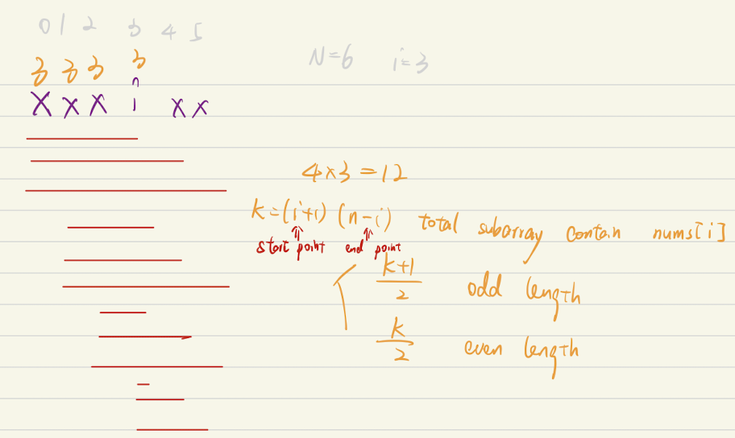

#### Brute force with Prefix Sum

```java
class Solution {
    public int sumOddLengthSubarrays(int[] arr) {
        int N = arr.length;
        int[] prefix = new int[N + 1]; // exlusive
        for (int i = 1; i < N + 1; i += 1) {
            prefix[i] = prefix[i - 1] + arr[i - 1];
        }
        
        int sum = 0;
        for (int i = 0; i < N; i += 1) {
            for (int j = i; j < N; j += 1) {
                if ((j - i + 1) % 2 == 1) {
                    sum += prefix[j + 1] - prefix[i];
                }
            }
        }
        return sum;
    }
}
```

#### Math



```java
class Solution {
    public int sumOddLengthSubarrays(int[] arr) {
        int res = 0, n = arr.length;
        for (int i = 0; i < n; ++i) {
            // each num will appear in ((i + 1) * (n - i) + 1) / 2 times in the subarrays -- num of start point * num of end point / 2
            res += ((i + 1) * (n - i) + 1) / 2 * arr[i];
        }
        return res;
    }
}
```

