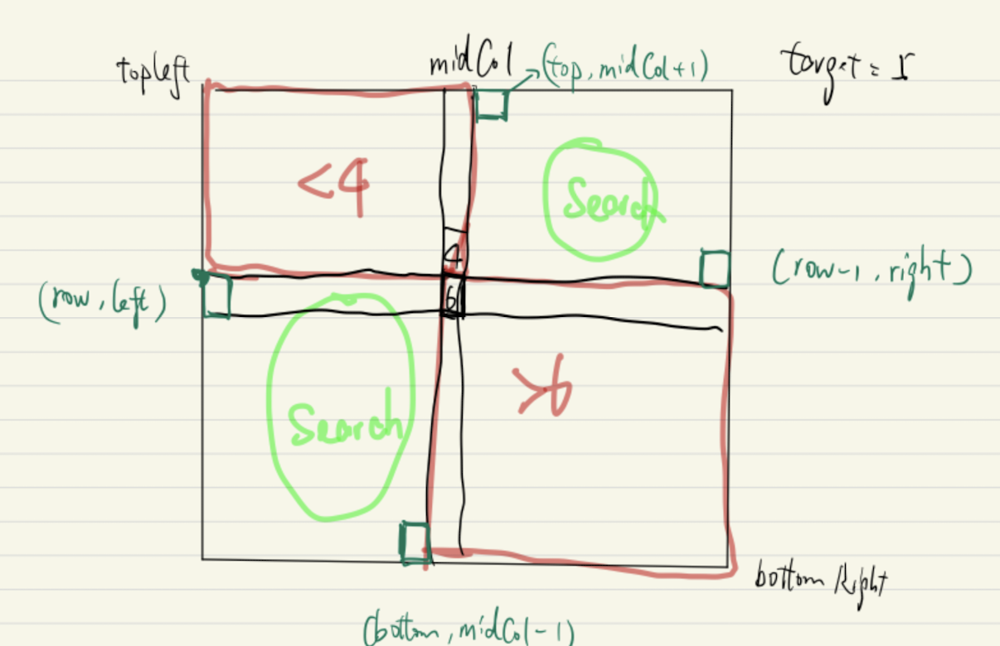

#### Divide and Conquer



```java
class Solution {
    // divide and conquer
    // we divide each matrix into 4 matrixes and topleft and each time bottomright matrix would be exclusive
    public boolean searchMatrix(int[][] matrix, int target) {
        return search(matrix, target, new int[]{0, 0}, new int[]{matrix.length - 1, matrix[0].length - 1});
    }
    
    private boolean search(int[][] matrix, int target, int[] topLeft, int[] bottomRight) {
        int top = topLeft[0];
        int bottom = bottomRight[0];
        int left = topLeft[1];
        int right = bottomRight[1];
        
        // base case
        if (top > bottom || left > right) {
            return false;
        }
        if (target < matrix[top][left] || target > matrix[bottom][right]) {
            return false;
        }
        if (top == bottom && left == right) {
            // one element remain
            return matrix[top][left] == target;
        }
        
        int midCol = (left + right) / 2;
        int row = top;
        while (row <= bottom && matrix[row][midCol] <= target) {
            if (matrix[row][midCol] == target) {
                return true;
            }
            row += 1;
        }
        // matrix[row - 1][midCol] < target < matrix[row][midCol]
        // We can only search 2 / 4 submatrix
        
        return search(matrix, target, new int[]{row, left}, new int[]{bottom, midCol - 1}) || search(matrix, target, new int[]{top, midCol + 1}, new int[]{row - 1, right});
    }
    
    // Time: O(N log N)
}
```

#### Binary Search

```java
class Solution {
    private boolean binarySearch(int[][] matrix, int target, int start, boolean vertical) {
        int lo = start;
        int hi = vertical ? matrix[0].length-1 : matrix.length-1;

        while (hi >= lo) {
            int mid = (lo + hi)/2;
            if (vertical) { // searching a column
                if (matrix[start][mid] < target) {
                    lo = mid + 1;
                } else if (matrix[start][mid] > target) {
                    hi = mid - 1;
                } else {
                    return true;
                }
            } else { // searching a row
                if (matrix[mid][start] < target) {
                    lo = mid + 1;
                } else if (matrix[mid][start] > target) {
                    hi = mid - 1;
                } else {
                    return true;
                }
            }
        }

        return false;
    }

    public boolean searchMatrix(int[][] matrix, int target) {
        // an empty matrix obviously does not contain `target`
        if (matrix == null || matrix.length == 0) {
            return false;
        }

        // iterate over matrix diagonals
        int shorterDim = Math.min(matrix.length, matrix[0].length);
        for (int i = 0; i < shorterDim; i++) {
            boolean verticalFound = binarySearch(matrix, target, i, true);
            boolean horizontalFound = binarySearch(matrix, target, i, false);
            if (verticalFound || horizontalFound) {
                return true;
            }
        }
        
        return false; 
    }
  	// O(log(n!))
}
```

#### Search Space Reduction -- O(m + n)

```java
class Solution {
    public boolean searchMatrix(int[][] matrix, int target) {
        // start our "pointer" in the bottom-left
        int row = matrix.length-1;
        int col = 0;

        while (row >= 0 && col < matrix[0].length) {
            if (matrix[row][col] > target) {
                // Every value to its right will also be too large and every element to its left has been already thrown away before. So we won't consider this row anymore
                row--;
            } else if (matrix[row][col] < target) {
                col++;
            } else {
                return true;
            }
        }

        return false;
    }
    // Time: O(m + n)
}
```

