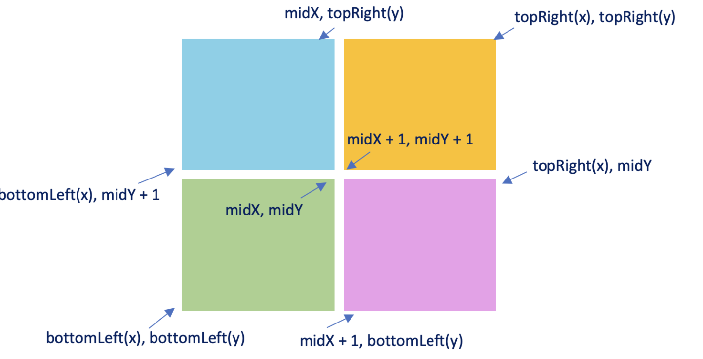

* The basic idea is easy
  * we divide the rectangle into 4 pieces and do recursion on each small rectangle
* The key part is the base case -- When to stop / how to track only the on point
  * in that case, no subrectangle would have **overlapping parts**
  * And when come to the 1*1 rectangle, it will **break into four points** and would not do recursion forever



#### Naive

```java
/**
 * // This is Sea's API interface.
 * // You should not implement it, or speculate about its implementation
 * class Sea {
 *     public boolean hasShips(int[] topRight, int[] bottomLeft);
 * }
 */

class Solution {
    public int countShips(Sea sea, int[] topRight, int[] bottomLeft) {
        
        if (bottomLeft[0] > topRight[0] || bottomLeft[1] > topRight[1]) {
            return 0;
        }
        if (!sea.hasShips(topRight, bottomLeft)) {
            return 0;
        }
        if (bottomLeft[0] == topRight[0] && bottomLeft[1] == topRight[1]) {
            return 1;
        }
        int[] leftMid = new int[]{bottomLeft[0], (topRight[1] + bottomLeft[1])/ 2 + 1};
        int[] rightMid = new int[]{topRight[0] + 1, (topRight[1] + bottomLeft[1])/ 2};
        int[] upMid = new int[]{(bottomLeft[0] + topRight[0]) / 2, topRight[1]};
        int[] downMid = new int[]{(bottomLeft[0] + topRight[0]) / 2 + 1, bottomLeft[1]};
        int[] center1 = new int[]{(bottomLeft[0] + topRight[0]) / 2, (bottomLeft[1] + topRight[1]) / 2};
        int[] center2 = new int[]{(bottomLeft[0] + topRight[0]) / 2 + 1, (bottomLeft[1] + topRight[1]) / 2 + 1};
        return countShips(sea, upMid, leftMid) + countShips(sea, topRight, center2)
            + countShips(sea, center1, bottomLeft) + countShips(sea, rightMid, downMid);
    }
}
```

#### Answer

```java
class Solution {
    public int countShips(Sea sea, int[] topRight, int[] bottomLeft) {
        // If the current rectangle does not contain any ships, return 0.         
        if (bottomLeft[0] > topRight[0] || bottomLeft[1] > topRight[1])
            return 0;
        if (!sea.hasShips(topRight, bottomLeft))
            return 0;

        // If the rectangle represents a single point, a ship is located
        if (topRight[0] == bottomLeft[0] && topRight[1] == bottomLeft[1])
            return 1;

        // Recursively check each of the 4 sub-rectangles for ships
        int midX = (topRight[0] + bottomLeft[0]) / 2;
        int midY = (topRight[1] + bottomLeft[1]) / 2;
        return countShips(sea, new int[]{midX, midY}, bottomLeft) +
               countShips(sea, topRight, new int[]{midX + 1, midY + 1}) +
               countShips(sea, new int[]{midX, topRight[1]}, new int[]{bottomLeft[0], midY + 1}) +
               countShips(sea, new int[]{topRight[0], midY}, new int[]{midX + 1, bottomLeft[1]});
    }
}
```

