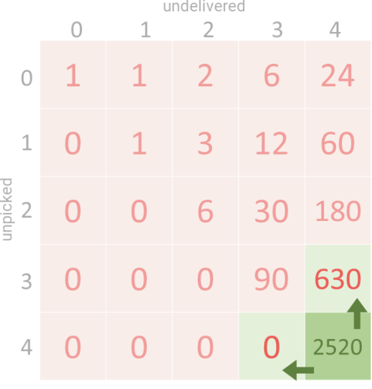

#### MyConbination

```java
class Solution {
    public int countOrders(int n) {
        long count = 1;
        int MOD = 1000000007;
        int sum = 0; // when n + 1, sum plus 2 * i - 1 + 2 * i - 2 and the count should multiply the new count
        for (int i = 1; i <= n; i += 1) {
            sum += 2 * i - 1 + 2 * i - 2;
            count *= sum;
            count %= MOD;
        }
        return (int)count;
    }
    // A 100% combination problem:
    // We consider the P and D as pairs
    // if n = 3 , we have totally 6 spots
    // the first P has 5 positions and the corresponding possiblity for the pair is -- 1 + 2 + 3 + 4 + 5 = 15
    // the second P has 3 positions left and the corresponding possiblity for the pair is - 1 + 2 + 3 = 6
    // the third P has 1 position so the corresponding possiblity for the pair is -- 1
    // the total possibility is 15 * 6 * 1 = 90 (put the first pair and then put the second pair and then put the last pair)
    
    // For n = 4, the first P has 1 + 2 ... + 7 = 28 pairs
    // The result = 90 * 28
}
```

### Answer

* The key idea :

  * We have to options pickup and deliver, the total possibility is P(we choose to pickup) + P(we choose to deliver)

    * if unpicked up > 0, we can choose to pickup

      * ```
        waysToPick += unpicked * dp[unpicked - 1][undelivered]
        ```

    * if undelivered > unpicked, we can choose to deliver

      * ```
        waysToDeliver += (undelivered - unpicked) * dp[unpicked][undelivered - 1]
        ```

#### Recursion + cache

```java
class Solution {
    private int MOD = 1_000_000_007;
    private long[][] memo;
    
    private long totalWays(int unpicked, int undelivered) {
        if (unpicked == 0 && undelivered == 0) {
            // We have completed all orders.
          	// It is a valid result and should return 1.
            return 1;
        }
        
        if (unpicked < 0 || undelivered < 0 || undelivered < unpicked) {
            // We can't pick or deliver more than N items
            // Number of deliveries can't exceed number of pickups 
            // as we can only deliver after a pickup.
            return 0;
        }
        
        if (memo[unpicked][undelivered] != 0) {
            // Return cached value, if already present. 
            return memo[unpicked][undelivered];
        }
        
        long ans = 0;
        
        // Count all choices of picking up an order.
      	// we have 'unpicked' number of unpicked package
      	// Each of the paclage we pickup have totalWays(unpicked - 1, undelivered) ways
        ans += unpicked * totalWays(unpicked - 1, undelivered);
        // Handle integer overflow.
        ans %= MOD;
        
        // Count all choices of delivering a picked order.
        ans += (undelivered - unpicked) * totalWays(unpicked, undelivered - 1);
        // Handle integer overflow.
        ans %= MOD;
        
        return memo[unpicked][undelivered] = ans;
    }
    
    public int countOrders(int n) {
      	// a cache to reduce time consumption
        memo = new long[n + 1][n + 1];
        return (int)totalWays(n, n);
    }
}
```

#### Bottom up Array



```java
class Solution {
    private int MOD = 1_000_000_007;
    
    public int countOrders(int n) {
        long[][] dp = new long[n + 1][n + 1];

        for (int unpicked = 0; unpicked <= n; unpicked++) {
            for (int undelivered = unpicked; undelivered <= n; undelivered++) {
                // If all orders are picked and delivered then,
                // for remaining '0' orders we have only one way.
                if (unpicked == 0 && undelivered == 0) {
                    dp[unpicked][undelivered] = 1;
                    continue;
                }
                
                // There are some unpicked elements left. 
                // We have choice to pick any one of those orders.
                if (unpicked > 0) {
                    dp[unpicked][undelivered] += unpicked * dp[unpicked - 1][undelivered];
                }
                dp[unpicked][undelivered] %= MOD;
                
                // Number of deliveries done is less than picked orders.
                // We have choice to deliver any one of (undelivered - unpicked) orders. 
                if (undelivered > unpicked) {
                    dp[unpicked][undelivered] += (undelivered - unpicked) * dp[unpicked][undelivered - 1];
                }
                dp[unpicked][undelivered] %= MOD;
            }
        }
        
        return (int)dp[n][n];
    }
}
```

#### Permutation

* n= 4
* For P -- we have 4 * 3 * 2 * 1
* For D, for example, permutation of P is P2 P4 P1 P3
  * D3 have 1 position to choose
  * D1 have 3
  * D4 have 5
  * D2 hav3 7

```java
class Solution {
    public int countOrders(int n) {
        long ans = 1;
        int MOD = 1_000_000_007;

        for (int i = 1; i <= n; ++i) {
            // Ways to arrange all pickups, 1*2*3*4*5*...*n
            ans = ans * i;
            // Ways to arrange all deliveries, 1*3*5*...*(2n-1)
            ans = ans * (2 * i - 1);
            ans %= MOD;
        }
        
        return (int)ans;
    }
}
```

#### Math

* If we don't consider the order of D and P, the total number is n!
* When consider D1P1, it has 1/2 possibility that they are in the right order
* When consider D2P2,it has 1/2 possibility that they are in the right order
* The total correct answer is **(2N)!/$2<sup>N</sup>**.

```java
class Solution {
    public int countOrders(int n) {
        long ans = 1;
        int MOD = 1_000_000_007;
        
        for (int i = 1; i <= 2 * n; ++i) {
            ans = ans * i;
            
            // We only need to divide the result by 2 n-times.
            // To prevent decimal results we divide after multiplying an even number.
            if (i % 2 == 0) {
                ans = ans / 2;
            }
            ans %= MOD;
        }
        return (int)ans;
    }
}
```

