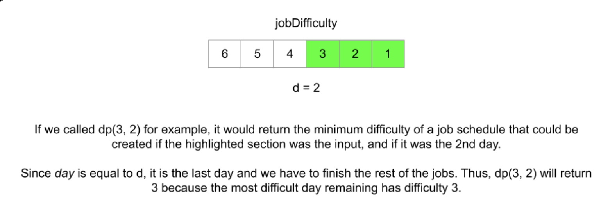

##### Why dp?

* Minimum
* Today's work affects future days

##### 3 steps

###### state variables

* i: the index of the first job that will be done on the current day
* day: current day
* **dp(i, day)** returns the minimum difficulty of a job schedule which **starts (it is ends in 198 robber)** on the `ith` job and `day` day
  * To solve the original problem, we will return dp(0, 1)



###### recurrence relation

* We need to do at least one job per day.
  * We must leave at least d - day jobs.
    * Job j `(i <= j < n - (d - day))`
  * Keep track of the difficulty of the hardest job done today, `hardest`
  * Our total difficulty is `hardest + dp(j + 1, day + 1)`

* summary
  * `dp(i, day) = min(hardest + dp(j + 1, day + 1)) for all i ≤ j < n - (d - day), where hardest = max(jobDifficulty[k]) for all i ≤ k ≤ j.`

###### Base cases

* `if day == d, return maxjobDifficulty remains, else if n < d, return -1`

#### Memoization

```java
class Solution {
    private int N; // the quantity of jobs
    private int D; // total days allowed
    private int[] jobDifficulty;
    private int[][] memo;
    private int[] hardestJobRemaining; // cache for base case computing
    
    public int minDifficulty(int[] jobDifficulty, int d) {
        this.N = jobDifficulty.length;
        this.D = d;
        
        if (N < D) {
            return -1;
        }
        
        this.jobDifficulty = jobDifficulty;
        this.memo = new int[N][D + 1]; // day is 1-index
        
        // build the array hardest job remaining for the base case in dp
        hardestJobRemaining = new int[N];
        int hardestJob = 0;
        for (int i = N - 1; i >= 0; i -= 1) {
            hardestJob = Math.max(hardestJob, jobDifficulty[i]);
            hardestJobRemaining[i] = hardestJob;
        }
        
        // Initialize memo array with value of -1.
        for (int i = 0; i < N; i++) {
            Arrays.fill(memo[i], -1);
        }
        
        return dp(0, 1);
    }
    
    private int dp(int i, int day) {
        
        // base case: the last day
        if (day == D) {
            memo[i][day] = hardestJobRemaining[i];
            return memo[i][day];
        }
        
        // recurrance relation
        if (memo[i][day] == -1) {
            int hardest = 0;
            int minimumDifficultySum = Integer.MAX_VALUE;
            
            // iterate all the options
            for (int j = i; j < N - (D - day); j += 1) {
                // update the hardest job so far
                hardest = Math.max(hardest, jobDifficulty[j]);
                // recurrance relation
                minimumDifficultySum = Math.min(minimumDifficultySum, 
                                                hardest + dp(j + 1, day + 1));
            }
            memo[i][day] = minimumDifficultySum;
        }
        return memo[i][day];
    }
}
```

#### Tabulation

* dp[i][day) represents the minimum difficulty of a job schedule that starts on day `day` and job `i`

```java
class Solution {
    public int minDifficulty(int[] jobDifficulty, int d) {
        int n = jobDifficulty.length;
        // If we cannot schedule at least one job per day, 
        // it is impossible to create a schedule
        if (n < d) {
            return -1;
        }
        
        int dp[][] = new int[n][d + 1]; // [n][0] is always 0 because we start from day1
        for (int[] row: dp) {
            Arrays.fill(row, Integer.MAX_VALUE);
        }
        
        // base cases -- update the last col
        dp[n - 1][d] = jobDifficulty[n - 1];
        for (int i = n - 2; i >= 0; i--) {
            dp[i][d] = Math.max(dp[i + 1][d], jobDifficulty[i]);
        }
        
        // tabulation -- iteration in tabulation: go through all the options
        for (int day = d - 1; day > 0; day -= 1) {
            for (int i = day - 1; i < n - (d - day); i += 1) {
                // why [day - 1, n - (d - day))?
                // We need to allocate at least one job for the day before(day - 1) and the day after n - (n - day)
                int hardest = 0;
                // Iterate through the options and choose the best
                for (int j = i; j < n - (d - day); j++) {
                    hardest = Math.max(hardest, jobDifficulty[j]);
                    // Recurrence relation
                    dp[i][day] = Math.min(dp[i][day], hardest + dp[j + 1][day + 1]);
                }
            }
        }
        
        return dp[0][1];
    }
}
```

