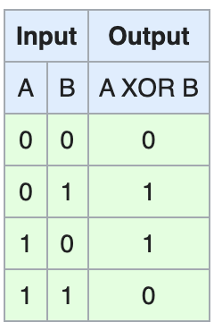

### XOR gate operation

* If we take XOR of zero and some bit, it will return that bit
  - *a* ⊕ 0 = *a*
* If we take XOR of two same bits, it will return 0
  - *a* ⊕ *a*=0
* *a* ⊕ *b* ⊕ *a* = (*a* ⊕ *a*) ⊕ *b*= 0 ⊕ *b* = *b*


a = 0011 1100

b = 0000 1101

\-----------------

a&b = 0000 1100

a|b = 0011 1101

a^b = 0011 0001

~a = 1100 0011


> **xor** is useful when:
>
> ```java
> if (a == 0) {
> 	b = 1;
> } else {
> 	b = 0
> }
> ```
>
> is equivalent to
>
> ```java
> b = a ^ 1; // 0 ^ 1 = 1, 1 ^ 1 = 0
> ```