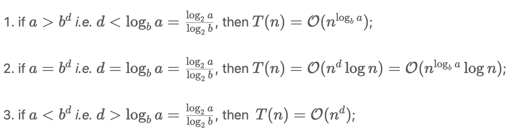

#### Master Theroem

* [Master Theorem](https://en.m.wikipedia.org/wiki/Master_theorem_(analysis_of_algorithms)), also known as Master Method, provides asymptotic analysis (*i.e.* the time complexity) for many of the recursion algorithms that follow the pattern of divide-and-conquer. 


```c++
function dac( n ):
   if n < k:  // k: some constant
     Solve "n" directly without recursion
   else:
     [1]. divide the problem "n" into "b" subproblems of equal size.
       - then the size of each subproblem would be "n/b"
     [2]. call the function "dac()" recursively "a" times on the subproblems
     [3]. combine the results from the subproblems
```

* For the recursion algorithms that follow the above patten, one can apply the master theorem to calculate their time complexity.

If we define the time complexity of the above recursion algorithm as *T*(*n*), then we can express it as follows:

​													*T*(*n*) = *a*⋅*T*(*n / b*) + *f*(*n*)

where *f*(*n*) is the time complexity that it takes to divide the problems into subproblems and also to combine the results from the subproblems. We can further represent *f*(*n*) as O(*n<sup>d</sup>*) and *d* ≥ 0. 

Then, Master Theorem provides us three formulas to calculate the time complexity of the recursion algorithm, according to the relationship among {a, b, d}. They are stated as follows:



The conditions for each case correspond to the intuition of whether the work to split problems and combine results (*i.e.* *f*(*n*)) outweighs the work of subproblems (*i.e.* a*⋅*T(*n / b*)).


#### Case 1) Binary tree traversal -- DFS

$$
T(n) = O(n^{log_ba})
$$

*T*(*n*) = *a*⋅*T*(*n / b*) + *f*(*n*)

* We divide the problem into two halves each recursion, i.e. left child and right child.
  * b = 2
* Both subproblems need to be solved
  * a = 2
* f(n) = O(1)
  * d = 0
* d < log<sub>b</sub>a 
  * *T*(*n*)=O(n <sup>log<sub>b</sub>a</sup>)=O(*n*)

#### Case 2) Binary Search

* We divide the searching area into 2 halves
  * b = 2
* Only one of the subproblems need to be solved
  * a = 1
* f(n) = O(1)
  *  d = 0

* d  = log<sub>b</sub>a
  * T(n) = O(n<sup>d</sup> log n) = O(log n)

* Another example: merge sort

#### Case 3) *T*(*n*) = O(*n<sup>d</sup>*)

* Here, the efforts of dividing problems and aggregating results overweight the efforts of solving subproblems.
* Quickselect