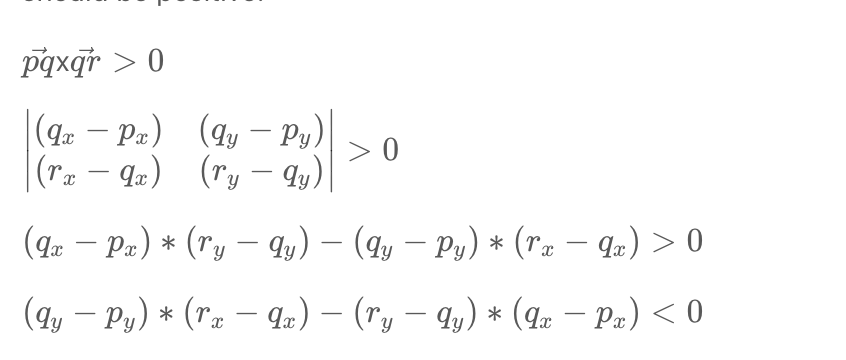

## [587. Erect the Fence](https://leetcode.com/problems/erect-the-fence/)

Too hard -- not understand --


#### Jarvis Algorithm

$$
\vec{pq} \times \vec{qr} > 0
$$





```java
class Solution {
    // 
    public int orientation(int[] p, int[] q, int[] r) {
        return (q[1] - p[1]) * (r[0] - q[0]) - (q[0] - p[0]) * (r[1] - q[1]);
    }
    
    public boolean inBetween(int[] p, int[] i, int[] q) {
        boolean a = i[0] >= p[0] && i[0] <= q[0] || i[0] <= p[0] && i[0] >= q[0];
        boolean b = i[1] >= p[1] && i[1] <= q[1] || i[1] <= p[1] && i[1] >= q[1];
        return a && b;
    }
    
    public int[][] outerTrees(int[][] points) {
        HashSet<int[]> hull = new HashSet<> ();
        if (points.length < 4) {
            for (int[] p: points)
                hull.add(p);
            return hull.toArray(new int[hull.size()][]);
        }
        int left_most = 0;
        for (int i = 0; i < points.length; i++)
            if (points[i][0] < points[left_most][0])
                left_most = i;
        int p = left_most;
        do {
            int q = (p + 1) % points.length;
            for (int i = 0; i < points.length; i++) {
                if (orientation(points[p], points[i], points[q]) < 0) {
                    q = i;
                }
            }
            for (int i = 0; i < points.length; i++) {
                if (i != p && i != q && orientation(points[p], points[i], points[q]) == 0 && inBetween(points[p], points[i], points[q])) {
                    hull.add(points[i]);
                }
            }
            hull.add(points[q]);
            p = q;
        }
        while (p != left_most);
        return hull.toArray(new int[hull.size()][]);
    }
}
```


####  Graham Scan

```java
public class Solution {
    public int orientation(int[] p, int[] q, int[] r) {
        return (q[1] - p[1]) * (r[0] - q[0]) - (q[0] - p[0]) * (r[1] - q[1]);
    }
    public int distance(int[] p, int[] q) {
        return (p[0] - q[0]) * (p[0] - q[0]) + (p[1] - q[1]) * (p[1] - q[1]);
    }

    private static int[] bottomLeft(int[][] points) {
        int[] bottomLeft = points[0];
        for (int[] p: points)
            if (p[1] < bottomLeft[1])
                bottomLeft = p;
        return bottomLeft;
    }
    public int[][] outerTrees(int[][] points) {
        if (points.length <= 1)
            return points;
        int[] bm = bottomLeft(points);
        Arrays.sort(points, new Comparator<int[]> () {
            public int compare(int[] p, int[] q) {
                double diff = orientation(bm, p, q) - orientation(bm, q, p);
                if (diff == 0)
                    return distance(bm, p) - distance(bm, q);
                else
                    return diff > 0 ? 1 : -1;
            }
        });
        int i = points.length - 1;
        while (i >= 0 && orientation(bm, points[points.length - 1], points[i]) == 0)
            i--;
        for (int l = i + 1, h = points.length - 1; l < h; l++, h--) {
            int[] temp = points[l];
            points[l] = points[h];
            points[h] = temp;
        }
        Stack<int[]> stack = new Stack< > ();
        stack.push(points[0]);
        stack.push(points[1]);
        for (int j = 2; j < points.length; j++) {
            int[] top = stack.pop();
            while (orientation(stack.peek(), top, points[j]) > 0)
                top = stack.pop();
            stack.push(top);
            stack.push(points[j]);
        }
        return stack.toArray(new int[stack.size()][]);
    }
}
```

