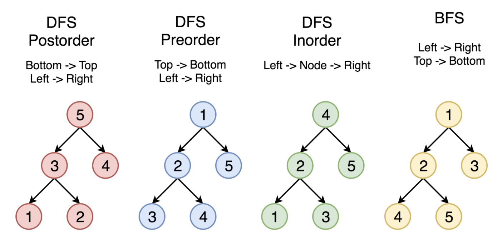

###### Takeaways

* We should always focus on the recursion first.
  * Topdown is easy
  * Bottomup is tricky


### Binary Tree

* A binary tree is a data structure in which each node has at most two children.

#### Traverse a tree



##### Pre-oder Traversal

 push right first, so that pop left first

```java
class Solution {
    public List<Integer> preorderTraversal(TreeNode root) {
        List<Integer> res = new LinkedList<>();
        Stack<TreeNode> stack = new Stack<>();
        if (root == null) {
            return res;
        }
        stack.push(root);
        while (!stack.isEmpty()) {
            TreeNode node = stack.pop();
            res.add(node.val);
            // push right first so pop left first
            if (node.right != null) {
                stack.push(node.right);
            }
            if (node.left != null) {
                stack.push(node.left);
            }
        }
        return res;
    }   
}
```

```java
public List<Integer> preorderTraversal(TreeNode root) {
    List<Integer> result = new ArrayList<>();
    Deque<TreeNode> stack = new ArrayDeque<>();
    TreeNode p = root;
    while(!stack.isEmpty() || p != null) {
        if(p != null) {
            stack.push(p);
            result.add(p.val);  // Add before going to children
            p = p.left;
        } else {
            TreeNode node = stack.pop();
            p = node.right;   
        }
    }
    return result;
}
```


##### In-order Traversal

* For **binary search tree**, we retrieve all the data in sorted order using **in-order** traversal.
* Go deep to the most left

```java
class Solution {
    public List<Integer> inorderTraversal(TreeNode root) {
        List<Integer> res = new LinkedList<>();
        Stack<TreeNode> stack = new Stack<>();
        TreeNode curr = root;
        while (!stack.isEmpty() || curr != null) {
            // go to the deepest left
            while (curr != null) {
                stack.push(curr);
                curr = curr.left;
            }
            curr = stack.pop();
            res.add(curr.val);
            curr = curr.right;
        }        
        return res; 
    }
}
```


##### Post-order Traversal

* When you **delete** a node, you will delete its left child and its right child before you delete the node itself.
* Widely using in **mathematical expression** -- **stack**

```java
class Solution {
    public List<Integer> postorderTraversal(TreeNode root) {
        List<Integer> res = new LinkedList<>();
        Stack<TreeNode> stack = new Stack<>();
        if (root == null) {
            return res;
        }
        stack.push(root);
        while (!stack.isEmpty()) {
            TreeNode curr = stack.pop();
            // add the curr to the first
            res.add(0, curr.val);
            // first left then right because we add first to the result
            if (curr.left != null) {
                stack.push(curr.left);
            }
            if (curr.right != null) {
                stack.push(curr.right);
            }
        }
        return res;
    }
}
```


#### Recursive or Iterative

* Recursive is easy
* Iterative is hard
  * Using stack to simulate the recusion process
  * When the depth of the tree is too large, we might suffer from `stack overflow` problem
    * so that we need to solve the problem iteratively


#### Solve Problems Recursively

* For each recursive function call, we only focus on the problem for the current node and call the function recursively to solve its children.

##### Top-down Solution

* Visit the node first to come up with some values and pass these values to its children when calling the function recursively
* a kind of preorder traversal
* Top_down(root, params)

```pseudocode
1. return specific value for null node
2. update the answer if needed                      // answer <-- params
3. left_ans = top_down(root.left, left_params)      // left_params <-- root.val, params
4. right_ans = top_down(root.right, right_params)   // right_params <-- root.val, params
5. return the answer if needed                      // answer <-- left_ans, right_ans
```

##### "Bottom-up" Solution

* Call the function recursively for all the children nodes and then come up with the answer according to the returned values and the value of the current node itself.

```pseudocode
1. return specific value for null node
2. left_ans = bottom_up(root.left)      // call function recursively for left child
3. right_ans = bottom_up(root.right)    // call function recursively for right child
4. return answers                       // answer <-- left_ans, right_ans, root.val
```

