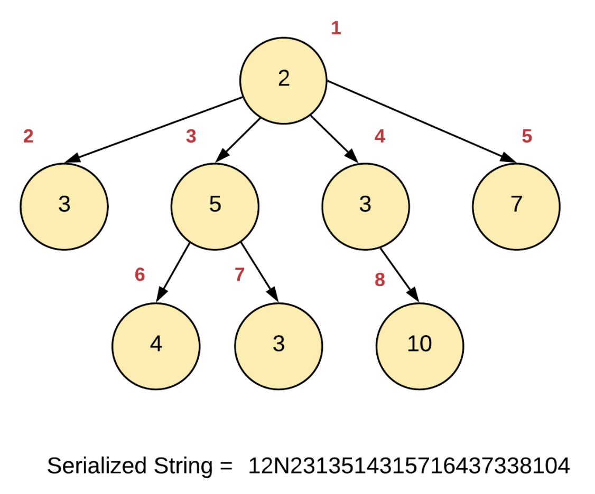
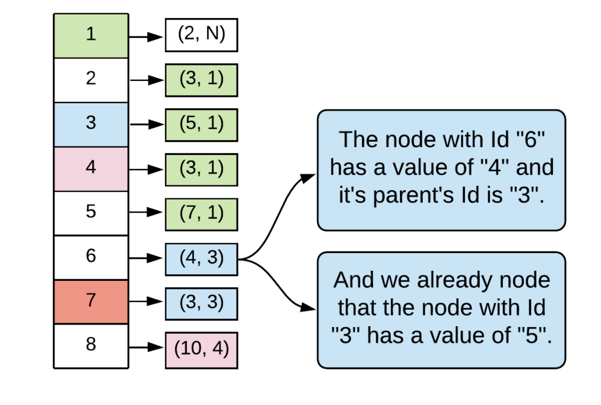
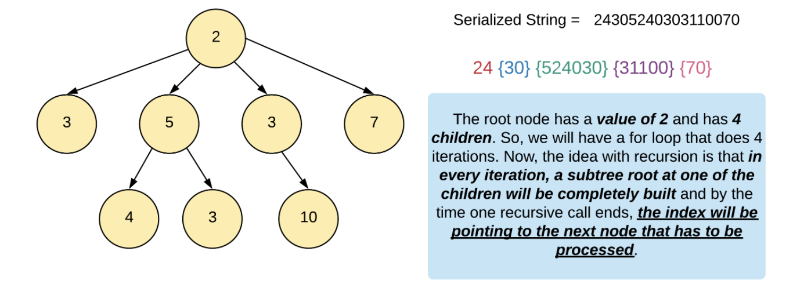
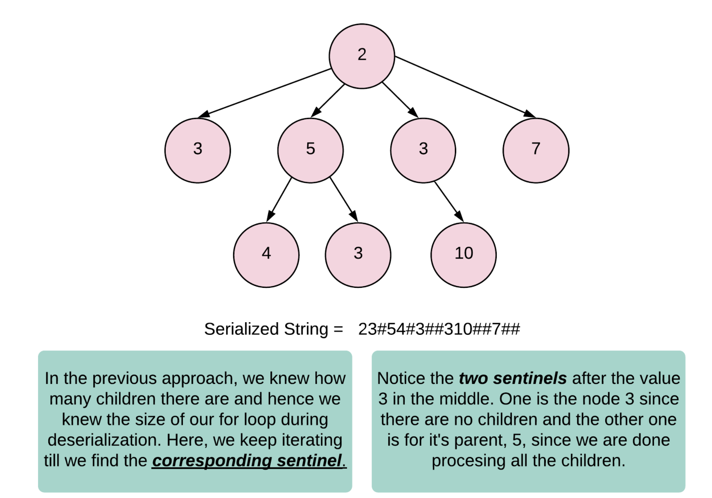

#### MyLevelOrder

```java
class Codec {
    // Encodes a tree to a single string.
    public String serialize(Node root) {
        if (root == null) {
            return "null";
        }
        Queue<Node> queue = new LinkedList<>();
        queue.add(root);
        StringBuilder sb = new StringBuilder();
        while (!queue.isEmpty()) {
            int size = queue.size();
            for (int i = 0; i < size; i += 1) {
                Node curr = queue.poll();
                sb.append(curr.val + ",");
                for (Node child : curr.children) {
                    queue.add(child);
                }
            }
            sb.append("null,");
        }
        return sb.toString();
    }
	
    // Decodes your encoded data to tree.
    public Node deserialize(String data) {
        String[] dataArray = data.split(",");
        List<String> dataList = new LinkedList<String>(Arrays.asList(dataArray));
        for (int i = 0; i < dataList.size(); i += 1) {
            
        }
        return null;
    }
}

```


#### Answer 1:  Parent Child relationships





```java
class Codec {

    class WrappableInt {
        private Integer value;
        public WrappableInt(Integer x) {
            this.value = x;
        }
        public Integer getValue() {
            return this.value;
        }
        public void increment() {
            this.value++;
        }
    }
    
    // Was searching for typedef alternatives in Java and came across fake classes
    // Mostly considered an anti-pattern but it definitely makes our code much more
    // readable!
    class DeserializedObject extends HashMap<Integer, Pair<Integer, Pair<Integer, Node>>> {}
    
    
    // Encodes a tree to a single string.
    public String serialize(Node root) {
        
        StringBuilder sb = new StringBuilder();
        this._serializeHelper(root, sb, new WrappableInt(1), null);
        return sb.toString();
    }
    
    private void _serializeHelper(Node root, StringBuilder sb, WrappableInt identity, Integer parentId) {
        
        if (root == null) {
            return;
        }
        
        // Own identity
        sb.append((char) (identity.getValue() + '0'));
        
        // Actual value
        sb.append((char) (root.val + '0'));
        
        // Parent's identity
        sb.append((char) (parentId == null ? 'N' : parentId + '0'));
        
        parentId = identity.getValue();
        for (Node child : root.children) {
            identity.increment();
            this._serializeHelper(child, sb, identity, parentId);
        }
    }

    // Decodes your encoded data to tree.
    public Node deserialize(String data) {
        if(data.isEmpty())
            return null;
        
        return this._deserializeHelper(data);
    }
    
    private Node _deserializeHelper(String data) {  
        
        // HashMap explained in the algorithm
        DeserializedObject nodesAndParents = new DeserializedObject();
        
        // Constructing the hashmap using the input string
        for (int i = 0; i < data.length(); i+=3) {
            int id = data.charAt(i) - '0';
            int orgValue = data.charAt(i + 1) - '0';
            int parentId = data.charAt(i + 2) - '0';
            Pair<Integer, Pair<Integer, Node>> node = new Pair<Integer, Pair<Integer, Node>>(orgValue, new Pair<Integer, Node>(parentId, new Node(orgValue, new ArrayList<Node>())));
            nodesAndParents.put(id, node);
        }
        
        // A second pass for tying up the proper child connections
        for (int i = 3; i < data.length(); i+=3) {
            
            // Current node
            int id = data.charAt(i) - '0';
            Node node = nodesAndParents.get(id).getValue().getValue();
            
            // Parent node
            int parentId = data.charAt(i + 2) - '0';
            Node parentNode = nodesAndParents.get(parentId).getValue().getValue();
            
            // Attach!
            parentNode.children.add(node);
        }
        
        // Return the root node.
        return nodesAndParents.get(data.charAt(0) - '0').getValue().getValue();
    }
}
```

#### Approach 2: Depth First Search with Children Sizes!



```java
class Codec {

    class WrappableInt {
        private int value;
        public WrappableInt(int x) {
            this.value = x;
        }
        public int getValue() {
            return this.value;
        }
        public void increment() {
            this.value++;
        }
    }
    
    // Encodes a tree to a single string.
    public String serialize(Node root) {
        
        StringBuilder sb = new StringBuilder();
        this._serializeHelper(root, sb);
        return sb.toString();
    }
    
    private void _serializeHelper(Node root, StringBuilder sb) {
        
        if (root == null) {
            return;
        }
        
        // Add the value of the node
        sb.append((char) (root.val + '0'));
        
        // Add the number of children
        sb.append((char) (root.children.size() + '0'));
        
        // Recurse on the subtrees and build the 
        // string accordingly
        for (Node child : root.children) {
            this._serializeHelper(child, sb);
        }
    }

    // Decodes your encoded data to tree.
    public Node deserialize(String data) {
        if(data.isEmpty())
            return null;
        
        return this._deserializeHelper(data, new WrappableInt(0));
    }
    
    private Node _deserializeHelper(String data, WrappableInt index) {  
        
        if (index.getValue() == data.length()) {
            return null;
        }
        
        // The invariant here is that the "index" always
        // points to a node and the value next to it 
        // represents the number of children it has.
        Node node = new Node(data.charAt(index.getValue()) - '0', new ArrayList<Node>());
        index.increment();
        int numChildren = data.charAt(index.getValue()) - '0';
        for (int i = 0; i < numChildren; i++) {
            index.increment();
            node.children.add(this._deserializeHelper(data, index));
        }
        
        return node;
    }
}
```

#### Approach 3: Depth First Search with a Sentinel



```java
class Codec {

    class WrappableInt {
        private int value;
        public WrappableInt(int x) {
            this.value = x;
        }
        public int getValue() {
            return this.value;
        }
        public void increment() {
            this.value++;
        }
    }
    
    // Encodes a tree to a single string.
    public String serialize(Node root) {
        
        StringBuilder sb = new StringBuilder();
        this._serializeHelper(root, sb);
        return sb.toString();
    }
    
    private void _serializeHelper(Node root, StringBuilder sb) {
        
        if (root == null) {
            return;
        }
        
        // Add the value of the node
        sb.append((char) (root.val + '0'));
        
        // Recurse on the subtrees and build the 
        // string accordingly
        for (Node child : root.children) {
            this._serializeHelper(child, sb);
        }
        
        // Add the sentinel to indicate that all the children
        // for the current node have been processed
        sb.append('#');
    }

    // Decodes your encoded data to tree.
    public Node deserialize(String data) {
        if(data.isEmpty())
            return null;
        
        return this._deserializeHelper(data, new WrappableInt(0));
    }
    
    private Node _deserializeHelper(String data, WrappableInt index) {  
        
        if (index.getValue() == data.length()) {
            return null;
        }
        
        Node node = new Node(data.charAt(index.getValue()) - '0', new ArrayList<Node>());
        index.increment();
        while (data.charAt(index.getValue()) != '#') {
            node.children.add(this._deserializeHelper(data, index));
        }
        
        // Discard the sentinel. Note that this also moves us
        // forward in the input string. So, we don't have the index
        // progressing inside the above while loop!
        index.increment();
        
        return node;
    }
}
```

#### Approach 4: Level order traversal

```java
class Codec {

    // Encodes a tree to a single string.
    public String serialize(Node root) {
        
        if (root == null) {
            return "";
        }
        
        StringBuilder sb = new StringBuilder();
        this._serializeHelper(root, sb);
        return sb.toString();
    }
    
    private void _serializeHelper(Node root, StringBuilder sb) {
        
        // Queue to perform a level order traversal of the tree
        Queue<Node> q = new LinkedList<Node>();
        
        // Two dummy nodes that will help us in serialization string formation.
        // We insert the "endNode" whenever a level ends and the "childNode"
        // whenever a node's children are added to the queue and we are about
        // to switch over to the next node.
        Node endNode = new Node();
        Node childNode = new Node();
        q.add(root);
        q.add(endNode);
        
        while (!q.isEmpty()) {
            
            // Pop a node
            Node node = q.poll();
            
            // If this is an "endNode", we need to add another one
            // to mark the end of the current level unless this
            // was the last level.
            if (node == endNode) {
                
                // We add a sentinal value of "#" here
                sb.append('#');
                if (!q.isEmpty()) {
                    q.add(endNode);  
                }
            } else if (node == childNode) {
                
                // Add a sentinal value of "$" here to mark the switch to a
                // different parent.
                sb.append('$');
            } else {
                
                // Add value of the current node and add all of it's
                // children nodes to the queue. Note how we convert
                // the integers to their corresponding ASCII counterparts.
                sb.append((char) (node.val + '0'));
                for (Node child : node.children) {
                    q.add(child);
                }
                
                // If this not is NOT the last one on the current level, 
                // add a childNode as well since we move on to processing
                // the next node.
                if (q.peek() != endNode) {
                    q.add(childNode);
                }
            }
        }
    }

    // Decodes your encoded data to tree.
    public Node deserialize(String data) {
        if (data.isEmpty()) {
            return null;
        }
            
        Node rootNode = new Node(data.charAt(0) - '0', new ArrayList<Node>());
        this._deserializeHelper(data, rootNode);
        return rootNode;
    }
    
    private void _deserializeHelper(String data, Node rootNode) {  
        
        // We move one level at a time and at every level, we need access
        // to the nodes on the previous level as well so that we can form
        // the children arrays properly. Hence two arrays.
        LinkedList<Node> currentLevel = new LinkedList<Node>();
        LinkedList<Node> prevLevel = new LinkedList<Node>();
        currentLevel.add(rootNode);
        Node parentNode = rootNode;
        
        // Process the characters in the string one at a time.
        for (int i = 1; i < data.length(); i++) {
            char d = data.charAt(i);
            if (d == '#') {
                // Special processing for end of level. We need to swap the
                // array lists. Here, we simply re-initialize the "currentLevel"
                // arraylist rather than clearing it.
                prevLevel = currentLevel;
                currentLevel = new LinkedList<Node>();
                
                // Since we move one level down, we take the parent as the first
                // node on the current level.
                parentNode = prevLevel.poll();
            } else {
                if (d == '$') {
                    
                    // Special handling for change in parent on the same level
                    parentNode = prevLevel.poll();
                } else {
                    Node childNode = new Node(d - '0', new ArrayList<Node>());    
                    currentLevel.add(childNode);
                    parentNode.children.add(childNode);
                }
            }
        }
    }
}
```

