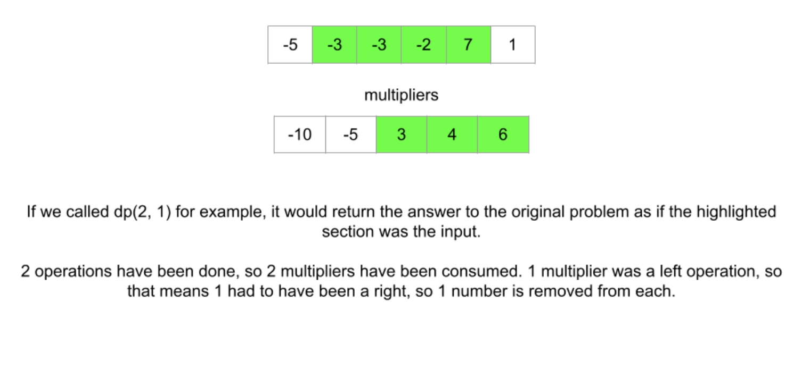

[DP card](https://leetcode.com/explore/learn/card/dynamic-programming/631/strategy-for-solving-dp-problems/4100/)

* Hard to understand because it is reversed from other dp problems

#### Top down

1. A **function**

* How many operations have we done so for -- what number from multipliers we will be using
* The index of the leftmost number remaining in nums
* The index of the rightmost number remaining in nums

##### state varible

* i: multipliers[i] is the current multiplier to be used. 
* left
* Right = n -1 - (i - left)

dp(i, left) return the maximum possible score if we have already done i total operations and used left numbers from the left side。



* dp(0, 0) means that the whole array is the input

* If we choose left, then the next operation will occur at (i + 1, left + 1). Why increase? -- (It represents how many operations we have done.) My explanation: The input array gets smaller as the process goes on. And the larger the index, the smaller the array left.

2. Recurrence relation

`dp(i, left) = Math.max(mult * nums[left] + dp(i + 1, left + 1), mult * nums[right] + dp(i + 1, left));`

3. Base cases: when i == m, that means no operations left.

#### top down

```java
class Solution {
    private int[] nums;
    private int[] multipliers;
    private int[][] memo;
    int N;
    int M;
    public int maximumScore(int[] nums, int[] multipliers) {
        this.N = nums.length;
        this.M = multipliers.length;
        this.nums = nums;
        this.multipliers = multipliers;
        this.memo = new int[M][M];
        
        return dp(0, 0);    // the direction is revered from house robber
    }
    
    // i: index of multipliers, left: left pointer of nums
    private int dp(int i, int left) {
        if (i == M) {
            return 0;
        }
        if (memo[i][left] == 0) {
            int mult = multipliers[i];
            int right = N - 1 - (i - left);
            memo[i][left] = Math.max(mult * nums[left] + dp(i + 1, left + 1), 
                                     mult * nums[right] + dp(i + 1, left));
        }        
        return memo[i][left];
    }
}
```

#### bottom up

```java
class Solution {
    public int maximumScore(int[] nums, int[] multipliers) {
        int n = nums.length;
        int m = multipliers.length;
        int[][] dp = new int[m + 1][m + 1];
        
        for (int i = m - 1; i >= 0; i--) {
            for (int left = i; left >= 0; left--) {
                int mult = multipliers[i];
                int right = n - 1 - (i - left);
                dp[i][left] = Math.max(mult * nums[left] + dp[i + 1][left + 1], 
                                       mult * nums[right] + dp[i + 1][left]);
            }
        }
        
        return dp[0][0];
    }
}
```


```java
public int maximumScore(int[] nums, int[] multipliers) {
        
	int N = nums.length, M = multipliers.length;

	return helper(nums, multipliers, 0, N - 1, new Integer[M][M]);
}

private int helper(int[] nums, int[] multipliers, int i, int j, Integer[][] dp) {

	int N = nums.length, M = multipliers.length;
	int index = (i - 0) + (N - 1 - j);
	if (index == M) return 0;

	if (dp[i][j - (N - M)] != null) return dp[i][j - (N - M)];

	int res = Math.max(nums[i] * multipliers[index] + helper(nums, multipliers, i + 1, j, dp), 
					   nums[j] * multipliers[index] + helper(nums, multipliers, i, j - 1, dp));

	return dp[i][j - (N - M)] = res;
}
```