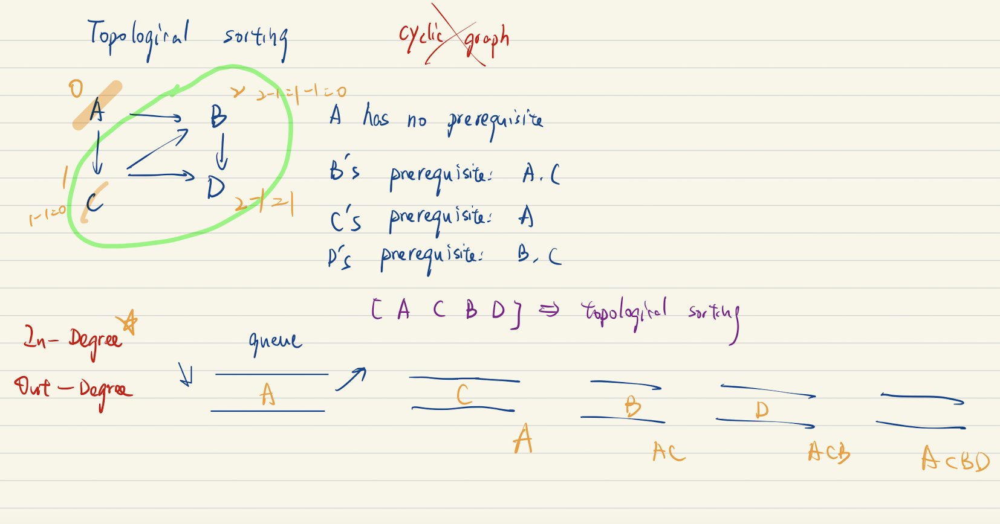

##### Introduction

* “**Topological sorting**” helps solve the problem. It provides a linear sorting based on the required ordering between vertices in **directed acyclic graphs**. 

* To be specific, given vertices `u` and `v`, to reach vertex `v`, we must have reached vertex `u` first. In “topological sorting”, `u` has to appear before `v` in the ordering. 
* The most popular algorithm for “topological sorting” is **Kahn’s algorithm**.

##### Complexity analysis

* We iterate over all of the courses and reduced the indegree of those for which the current course is a prerequisite.
  * Time: $O(V * E)$
  * Space: $O(V)$

* We can performed more efficiently by creating an adjacency list where `adjacencyList[course]` contains a list of courses that **depend on** $course$.
  * Time: $O(V + R)$
  * Space: $O(V + E)$

##### Limitation of the Algorithm

* “Topological sorting” only works with graphs that are **directed** and **acyclic**.

- There must be at least one vertex in the “graph” with an “in-degree” of 0. If all vertices in the “graph” have a non-zero “in-degree”, then all vertices need at least one vertex as a predecessor. In this case, no vertex can serve as the starting vertex.

#### Algorithm

> 1. We build an adjacency list. This allows us efficiently check which courses depend on each prerequisite course -- $O(E)$ time for iterating over all edges
> 2. We repeatedly visit each vertex with an in-degree of zero and decrement the in-degree of all courses that have this courses as a prerequisite(outgoing edges). -- $O(V + R)$