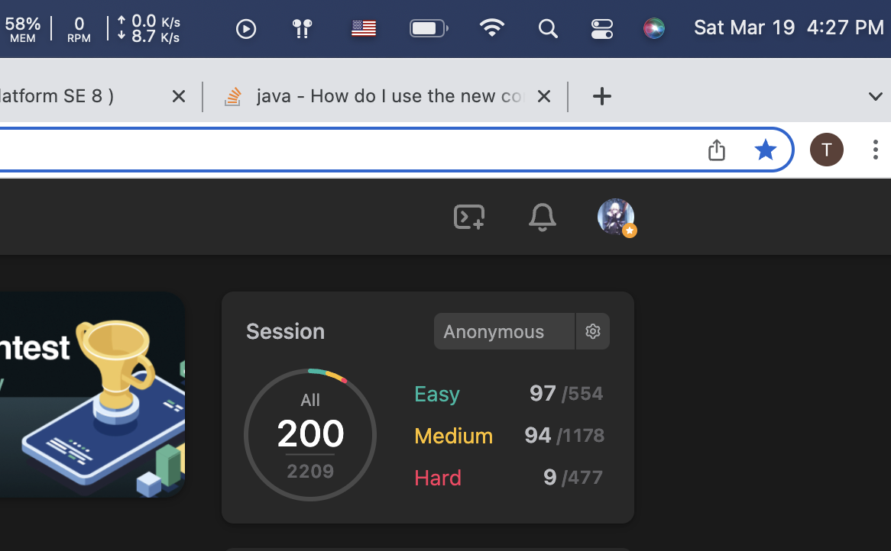

# 101-200

| Total | serial numbr | Name                                                         | Catalog                      | Time |
| ----- | ------------ | ------------------------------------------------------------ | ---------------------------- | ---- |
| 101   | 653          | Two Sum IV - Input is a BST                                  | Hashing                      | 2.20 |
|       |              |                                                              |                              |      |
|       | 98           | Validate Binary Search Tree                                  | BST                          | 2.20 |
|       | 28           | Implement strStr()                                           | String                       | 2.20 |
|       |              |                                                              |                              |      |
|       | 344          | Reverse String                                               | Two Pointer                  | 2.21 |
|       | 561          | Array Partition I                                            | Sorting                      | 2.21 |
|       | 209          | Minimum Size Subarray Sum                                    | Two Pointer                  | 2.21 |
|       | 189          | Rotate Array                                                 | Arraycopy                    | 2.21 |
|       | 119          | Pascal's Triangle II                                         | Math                         | 2,21 |
|       | 171          | Excel Sheet Column Number                                    | Math                         | 2.21 |
| 110   | 1064         | Fixed Point                                                  | Binary Search                | 2.21 |
|       | 1101         | The Earliest Moment When Everyone Become Friends             | UF                           | 2.21 |
|       | 151          | Reverse Words in a String                                    | String                       | 2.21 |
|       | 557          | Reverse Words in a String III                                | String                       | 2.21 |
|       |              |                                                              |                              |      |
|       | 133          | Clone Graph                                                  | Graph                        | 2.22 |
|       |              |                                                              |                              |      |
|       | 705          | Design HashSet                                               | Hash                         | 2.23 |
|       | 706          | Design HashMap                                               | Hash                         | 2.23 |
|       | 202          | Happy Number                                                 | HashSet                      | 2.23 |
|       | 205          | Isomorphic Strings                                           | HashMap                      | 2.23 |
|       | 599          | Minimum Index Sum of Two Lists                               | HashMap                      | 2.23 |
| 120   | 148          | Sort List                                                    | Sorting                      | 2.23 |
|       |              |                                                              |                              |      |
|       | 219          | Contains Duplicate II                                        | Sliding Window               | 2.24 |
|       | 359          | Logger Rate Limiter                                          | HashMap                      | 2.24 |
|       | 165          | Compare Version Numbers                                      | String                       | 2.24 |
|       |              |                                                              |                              |      |
|       | 228          | Summary Ranges                                               | Two pointer                  | 2.27 |
|       |              |                                                              |                              |      |
|       | 338          | Counting Bits                                                | Bit manipulation             | 2.28 |
|       |              |                                                              |                              |      |
|       | 392          | Is Subsequence                                               | String -  two Pointer        | 3.1  |
|       |              |                                                              |                              |      |
|       | 413          | Arithmetic Slices                                            | Array                        | 3.2  |
|       |              |                                                              |                              |      |
|       | 799          | Champagne Tower                                              | Math                         | 3.3  |
|       |              |                                                              |                              |      |
|       | 1490         | Clone N-ary Tree                                             | N-ary Tree                   | 3.4  |
| 130   | 49           | Group Anagrams                                               | Hash + String                | 3.4  |
|       | 249          | Group Shifted Strings                                        | Hash + String                | 3.4  |
|       |              |                                                              |                              |      |
|       | 740          | Delet and Earn                                               | Dynamic Programming          | 3.5  |
|       | 652          | Find Duplicate Subtrees                                      | HashMap                      | 3.5  |
|       | 771          | Jewels and Stones                                            | String                       | 3.5  |
|       | 2194         | Cells in a Range on an Excel Sheet                           | Array                        | 3.5  |
|       | 2196         | Create Binary Tree From Descriptions                         | HashTable + Tree             | 3.5  |
|       |              |                                                              |                              |      |
|       | 2195         | Append K Integers With Minimal Sum                           | Array                        | 3.6  |
|       | 1359         | Count All Valid Pickup and Delivery Options                  | Math                         | 3.6  |
|       | 170          | Two Sum III - Data structure design                          | Hash                         | 3.6  |
| 140   | 454          | 4Sum II                                                      | Hash                         | 3.6  |
|       | 15           | 3Sum                                                         | Hash or TwoPointer           | 3.6  |
|       |              |                                                              |                              |      |
|       | 347          | Top K Frequent Elements                                      | Heap                         | 3.7  |
|       | 288          | Unique Word Abbreviation                                     | HashMap                      | 3.7  |
|       | 380          | Insert Delete GetRandom                                      | HashMap+ArrayList            | 3.7  |
|       | 622          | Design Circular Queue                                        | Queue                        | 3.7  |
|       | 346          | Moving Average from Data Stream                              | Queue                        | 3.7  |
|       | 246          | Strobogrammatic Number                                       | String                       | 3.7  |
|       | 247          | Strobogrammatic Number II                                    | String + BFS                 | 3.7  |
|       |              |                                                              |                              |      |
|       | 286          | Walls and Gates                                              | BFS                          | 3.8  |
| 150   | 200          | Number of Islands                                            | DFS/BFS                      | 3.8  |
|       | 82           | Remove Duplicates from Sorted List II                        | ListNode                     | 3.8  |
|       | 752          | Open the Lock                                                | BFS                          | 3.8  |
|       | 279          | Perfect Squares                                              | BFS/Greedy/DP                | 3.8  |
|       |              |                                                              |                              |      |
|       | 151          | Min Stack                                                    | Stack                        | 3.9  |
|       | 739          | Daily Temperatures                                           | Stack                        | 3.9  |
|       | 150          | Evaluate Reverse Polish Notation                             | Stack                        | 3.9  |
|       | 494          | Target Sum                                                   | Dynamic Programming          | 3.9  |
|       | 225          | Implement Stack using Queues                                 | Stack                        | 3.9  |
|       |              |                                                              |                              |      |
|       | 394          | Decode String                                                | Stack                        | 3.10 |
| 160   | 733          | Flood Fill                                                   | DFS                          | 3.10 |
|       | 542          | 01 Matrix                                                    | BFS / DP                     | 3.10 |
|       | 841          | Keys and Rooms                                               | DFS/BFS                      | 3.10 |
|       |              |                                                              |                              |      |
|       | 509          | Fibonacci Number                                             | Recursion                    | 3.11 |
|       | 50           | Pow(x, n)                                                    | Recursion                    | 3.11 |
|       | 779          | K-th Symbol in Grammar                                       | Recursion                    | 3.11 |
|       | 96           | Unique Binary Search Tree                                    | Recursion + memoization / DP | 3.11 |
|       | 95           | Unique Binary Search Tree II                                 | Recursion                    | 3.11 |
|       | 704          | Binary Search                                                | Binary Search                | 3.11 |
|       |              |                                                              |                              |      |
|       | 374          | Guess Number Higher or Lower                                 | Binary Search                | 3.12 |
| 170   | 33           | Search in Rotated Sorted Array                               | Binary Search                | 3.12 |
|       | 278          | First Bad Version                                            | Binary Search                | 3.12 |
|       | 162          | Find Peak Element                                            | Binary Search                | 3.12 |
|       |              |                                                              |                              |      |
|       | 2200         | [2200. Find All K-Distant Indices in an Array](https://leetcode.com/problems/find-all-k-distant-indices-in-an-array) | Hash                         | 3.13 |
|       | 2201         | [2201. Count Artifacts That Can Be Extracted](https://leetcode.com/problems/count-artifacts-that-can-be-extracted) | Hash                         | 3.13 |
|       | 2202         | [2202. Maximize the Topmost Element After K Moves](https://leetcode.com/problems/maximize-the-topmost-element-after-k-moves) | Array                        | 3.13 |
|       | 153          | [153. Find Minimum in Rotated Sorted Array](https://leetcode.com/problems/find-minimum-in-rotated-sorted-array) | Binary Search                | 3.13 |
|       | 34           | [34. Find First and Last Position of Element in Sorted Array](https://leetcode.com/problems/find-first-and-last-position-of-element-in-sorted-array) | Binary Search                | 3.13 |
|       | 658          | [658. Find K Closest Elements](https://leetcode.com/problems/find-k-closest-elements) | Binary Search                | 3.13 |
|       |              |                                                              |                              |      |
|       | 71           | [71. Simplify Path](https://leetcode.com/problems/simplify-path) | Stack + String               | 3.14 |
| 180   | 270          | [270. Closest Binary Search Tree Value](https://leetcode.com/problems/closest-binary-search-tree-value) | BST                          | 3.14 |
|       | 702          | [702. Search in a Sorted Array of Unknown Size](https://leetcode.com/problems/search-in-a-sorted-array-of-unknown-size) | Binary Search                | 3.14 |
|       | 367          | [367. Valid Perfect Square](https://leetcode.com/problems/valid-perfect-square) | Binary Search                | 3.14 |
|       | 744          | [744. Find Smallest Letter Greater Than Target](https://leetcode.com/problems/find-smallest-letter-greater-than-target) | Binary Search                | 3.14 |
|       | 154          | [154. Find Minimum in Rotated Sorted Array II](https://leetcode.com/problems/find-minimum-in-rotated-sorted-array-ii) | Binary Search                | 3.14 |
|       | 287          | [287. Find the Duplicate Number](https://leetcode.com/problems/find-the-duplicate-number) | Negative marking             | 3.14 |
|       | 41           | [41. First Missing Positive](https://leetcode.com/problems/first-missing-positive) | Negative marking             | 3.14 |
|       |              |                                                              |                              |      |
|       | 1249         | [1249. Minimum Remove to Make Valid Parentheses](https://leetcode.com/problems/minimum-remove-to-make-valid-parentheses/) | Stack + String               | 3.15 |
|       |              |                                                              |                              |      |
|       | 946          | [946. Validate Stack Sequences](https://leetcode.com/problems/validate-stack-sequences/) | Stack                        | 3.16 |
|       | 1057         | [1057. Campus Bikes](https://leetcode.com/problems/campus-bikes) | Comparable                   | 3.16 |
|       |              |                                                              |                              |      |
| 190   | 856          | [856. Score of Parentheses](https://leetcode.com/problems/score-of-parentheses/) | Stack + String               | 3.17 |
|       | 4            | [4. Median of Two Sorted Arrays](https://leetcode.com/problems/median-of-two-sorted-arrays) | Partition + Binary Search    | 3.17 |
|       | 285          | [285. Inorder Successor in BST](https://leetcode.com/problems/inorder-successor-in-bst) | BST                          | 3.17 |
|       | 316          | [316. Remove Duplicate Letters](https://leetcode.com/problems/remove-duplicate-letters/) | Greedy                       | 3.17 |
|       |              |                                                              |                              |      |
|       | 1081         | [1081. Smallest Subsequence of Distinct Charact](https://leetcode.com/problems/smallest-subsequence-of-distinct-characters) | Greedy                       | 3.18 |
| 195   | 173          | [173. Binary Search Tree Iterator](https://leetcode.com/problems/binary-search-tree-iterator) | BST                          | 3.18 |
|       | 450          | [450. Delete Node in a BST](https://leetcode.com/problems/delete-node-in-a-bst) | BST                          | 3.18 |
|       | 220          | [220. Contains Duplicate III](https://leetcode.com/problems/contains-duplicate-iii) | BST                          | 3.18 |
|       |              |                                                              |                              |      |
|       | 895          | [895. Maximum Frequency Stack](https://leetcode.com/problems/maximum-frequency-stack/) | Stack                        | 3.19 |
|       | 703          | [703. Kth Largest Element in a Stream](https://leetcode.com/problems/kth-largest-element-in-a-stream) | Heap                         | 3.19 |
| 200   | 110          | [110. Balanced Binary Tree](https://leetcode.com/problems/balanced-binary-tree) | Binary Tree                  | 3.19 |

