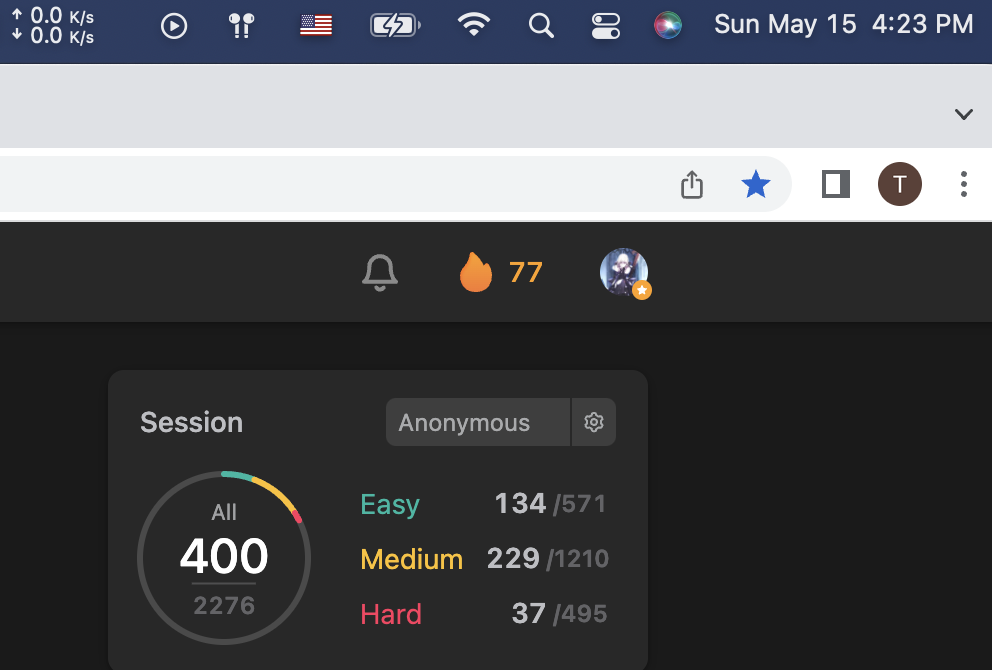

# 301-400

| Total | serial numbr | Name                                                         | Catalog                      | Time |
| ----- | ------------ | ------------------------------------------------------------ | ---------------------------- | ---- |
| 301   | DP           | [746. Min Cost Climbing Stairs](https://leetcode.com/problems/min-cost-climbing-stairs) | Dp                           | 4.16 |
|       | DP           | [1137. N-th Tribonacci Number](https://leetcode.com/problems/n-th-tribonacci-number) | DP                           | 4.16 |
|       | Daily        | [897. Increasing Order Search Tree](https://leetcode.com/problems/increasing-order-search-tree/) | BST                          | 4.16 |
|       |              |                                                              |                              |      |
|       | DP           | [1770. Maximum Score from Performing Multiplication Operations](https://leetcode.com/problems/maximum-score-from-performing-multiplication-operations) | Reversed dp                  | 4.17 |
|       | Contest      | [2243. Calculate Digit Sum of a String](https://leetcode.com/problems/calculate-digit-sum-of-a-string) | String                       | 4.17 |
|       | Contest      | [2244. Minimum Rounds to Complete All Tasks](https://leetcode.com/problems/minimum-rounds-to-complete-all-tasks) | Math                         | 4.17 |
|       | Contest      | [2245. Maximum Trailing Zeros in a Cornered ](https://leetcode.com/problems/maximum-trailing-zeros-in-a-cornered-path) | 2D array + math              | 4.17 |
|       | Contest      | [2246. Longest Path With Different Adjacent Characters](https://leetcode.com/problems/longest-path-with-different-adjacent-characters) | DFS                          | 4.17 |
|       |              |                                                              |                              |      |
|       | Daily        | [230. Kth Smallest Element in a BST](https://leetcode.com/problems/kth-smallest-element-in-a-bst/) | BST                          | 4.18 |
| 310   | DP           | [1143. Longest Common Subsequence](https://leetcode.com/problems/longest-common-subsequence) | DP                           | 4.18 |
|       | DP           | [221. Maximal Square](https://leetcode.com/problems/maximal-square) | DP + Matrix                  | 4.18 |
|       | DP           | [1335. Minimum Difficulty of a Job Schedule](https://leetcode.com/problems/minimum-difficulty-of-a-job-schedule) | Hard DP                      | 4.18 |
|       | Daily        | [99. Recover Binary Search Tree](https://leetcode.com/problems/recover-binary-search-tree/) | BST                          | 4.18 |
|       |              |                                                              |                              |      |
|       | DP           | [322. Coin Change](https://leetcode.com/problems/coin-change) | Confused dp                  | 4.19 |
|       | DP           | [139. Word Break](https://leetcode.com/problems/word-break)  | OMG                          | 4.19 |
|       | DP           | [300. Longest Increasing Subsequence](https://leetcode.com/problems/longest-increasing-subsequence) | DP                           | 4.19 |
|       | DP           | [188. Best Time to Buy and Sell Stock IV](https://leetcode.com/problems/best-time-to-buy-and-sell-stock-iv) | Hard DP                      | 4.19 |
|       |              |                                                              |                              |      |
|       | DP           | [309. Best Time to Buy and Sell Stock with Cooldown](https://leetcode.com/problems/best-time-to-buy-and-sell-stock-with-cooldown) | DP                           | 4.20 |
|       | DP           | [276. Paint Fence](https://leetcode.com/problems/paint-fence) | Counting DP                  | 4.20 |
| 320   | DP           | [518. Coin Change 2](https://leetcode.com/problems/coin-change-2) | Strange DP                   | 4.20 |
|       | DP           | [91. Decode Ways](https://leetcode.com/problems/decode-ways) | DP                           | 4.20 |
|       |              |                                                              |                              |      |
|       | DP           | [918. Maximum Sum Circular Subarray](https://leetcode.com/problems/maximum-sum-circular-subarray) | Kadane's Algorithm           | 4.21 |
|       | DP           | [62. Unique Paths](https://leetcode.com/problems/unique-paths) | DP Path                      | 4.21 |
|       | DP           | [63. Unique Paths II](https://leetcode.com/problems/unique-paths-ii) | DP Path                      | 4.21 |
|       | DP           | [64. Minimum Path Sum](https://leetcode.com/problems/minimum-path-sum) | DP Path                      | 4.21 |
|       | DP           | [931. Minimum Falling Path Sum](https://leetcode.com/problems/minimum-falling-path-sum) | DP Path                      | 4.21 |
|       | DP           | [122. Best Time to Buy and Sell Stock II](https://leetcode.com/problems/best-time-to-buy-and-sell-stock-ii) | DP                           | 4.21 |
|       | DP           | [123. Best Time to Buy and Sell Stock III](https://leetcode.com/problems/best-time-to-buy-and-sell-stock-iii) | DP                           | 4.21 |
|       |              |                                                              |                              |      |
|       | DP           | [714. Best Time to Buy and Sell Stock with Transaction Fee](https://leetcode.com/problems/best-time-to-buy-and-sell-stock-with-transaction-fee) | DP                           | 4.22 |
| 330   | Daily        | [535. Encode and Decode TinyURL](https://leetcode.com/problems/encode-and-decode-tinyurl/) | System Design                | 4.22 |
|       | Weekly       | [1166. Design File System](https://leetcode.com/problems/design-file-system) | System Design                | 4.22 |
|       | DP           | [256. Paint House](https://leetcode.com/problems/paint-house) | Basic DP                     | 4.22 |
|       |              |                                                              |                              |      |
|       | DP           | [265. Paint House II](https://leetcode.com/problems/paint-house-ii) | Basic DP                     | 4.23 |
|       |              |                                                              |                              |      |
|       | Daily        | [1396. Design Underground System](https://leetcode.com/problems/design-underground-system) | System Design                | 4.24 |
|       | Contest      | [2248. Intersection of Multiple Arrays](https://leetcode.com/problems/intersection-of-multiple-arrays) | Repetition                   | 4.24 |
|       | Contest      | [2249. Count Lattice Points Inside a Circle](https://leetcode.com/problems/count-lattice-points-inside-a-circle) | Simulation                   | 4.24 |
|       | Contest      | [2250. Count Number of Rectangles Containing Each Point](https://leetcode.com/problems/count-number-of-rectangles-containing-each-point) | Binary Search                | 4.24 |
|       | Contest      | [2251. Number of Flowers in Full Bloom](https://leetcode.com/problems/number-of-flowers-in-full-bloom) | Sorting                      | 4.24 |
|       | DP           | [1473. Paint House III](https://leetcode.com/problems/paint-house-iii) | TOO COMPLICATED              | 4.24 |
|       |              |                                                              |                              |      |
| 340   | Daily        | [284. Peeking Iterator](https://leetcode.com/problems/peeking-iterator/) | System Design                | 4.25 |
|       | DP           | [1220. Count Vowels Permutation](https://leetcode.com/problems/count-vowels-permutation) | Easy DP                      | 4.25 |
|       | DP           | [718. Maximum Length of Repeated Subarray](https://leetcode.com/problems/maximum-length-of-repeated-subarray) | Hard DP                      | 4.25 |
|       | DP           | [1155. Number of Dice Rolls With Target Sum](https://leetcode.com/problems/number-of-dice-rolls-with-target-sum) | Good DP                      | 4.25 |
|       | DP           | [790. Domino and Tromino Tiling](https://leetcode.com/problems/domino-and-tromino-tiling) | Hard to simulation           | 4.25 |
|       | DP           | [983. Minimum Cost For Tickets](https://leetcode.com/problems/minimum-cost-for-tickets) | state variables              | 4.25 |
|       |              |                                                              |                              |      |
|       | DP           | [97. Interleaving String](https://leetcode.com/problems/interleaving-string) | Final question for DP newbie | 4.26 |
|       | Trie         | [208. Implement Trie (Prefix Tree)](https://leetcode.com/problems/implement-trie-prefix-tree) | Prefix tree                  | 4.26 |
|       | Trie         | [677. Map Sum Pairs](https://leetcode.com/problems/map-sum-pairs) | 61B                          | 4.26 |
|       | Trie         | [648. Replace Words](https://leetcode.com/problems/replace-words) | Trie                         | 4.26 |
| 350   | Tackle DS    | [75. Sort Colors](https://leetcode.com/problems/sort-colors) | Counting sort                | 4.26 |
|       |              |                                                              |                              |      |
|       | Tackle DS    | [56. Merge Intervals](https://leetcode.com/problems/merge-intervals) | Sorting                      | 4.27 |
|       | Daily        | [1631. Path With Minimum Effort](https://leetcode.com/problems/path-with-minimum-effort) | PFS                          | 4.27 |
|       | Tackle DS    | [48. Rotate Image](https://leetcode.com/problems/rotate-image) | Matrix                       | 4.27 |
|       |              |                                                              |                              |      |
|       | Trie         | [211. Design Add and Search Words Data Stru](https://leetcode.com/problems/design-add-and-search-words-data-structure) | Helper function              | 4.28 |
|       | Tackle DS    | [435. Non-overlapping Intervals](https://leetcode.com/problems/non-overlapping-intervals/) | Overlapping                  | 4.28 |
|       | Daily        | [785. Is Graph Bipartite?](https://leetcode.com/problems/is-graph-bipartite/) | Graph                        | 4.28 |
|       |              |                                                              |                              |      |
|       | Tackle DS    | [334. Increasing Triplet Subsequence](https://leetcode.com/problems/increasing-triplet-subsequence) | Greedy                       | 4.29 |
|       | Tackle DS    | [238. Product of Array Except Self](https://leetcode.com/problems/product-of-array-except-self) | Prefix sum                   | 4.29 |
|       | Tackle DS    | [415. Add Strings](https://leetcode.com/problems/add-strings) | String                       | 4.29 |
| 360   | Tackle DS    | [409. Longest Palindrome](https://leetcode.com/problems/longest-palindrome) | String                       | 4.29 |
|       | Tackle DS    | [290. Word Pattern](https://leetcode.com/problems/word-pattern) | HashMap                      | 4.29 |
|       | Tackle DS    | [43. Multiply Strings](https://leetcode.com/problems/multiply-strings) | String                       | 4.29 |
|       |              |                                                              |                              |      |
|       | Tackle DS    | [187. Repeated DNA Sequences](https://leetcode.com/problems/repeated-dna-sequences) | HashSet                      | 4.30 |
|       | Contest      | [2255. Count Prefixes of a Given String](https://leetcode.com/problems/count-prefixes-of-a-given-string) | String                       | 4.30 |
|       | Contest      | [2256. Minimum Average Difference](https://leetcode.com/problems/minimum-average-difference) | Prefix                       | 4.30 |
|       | Contest      | [2257. Count Unguarded Cells in the Grid](https://leetcode.com/problems/count-unguarded-cells-in-the-grid) | Simulation                   | 4.30 |
|       | Contest      | [2258. Escape the Spreading Fire](https://leetcode.com/problems/escape-the-spreading-fire) | BFS                          | 4.30 |
|       |              |                                                              |                              |      |
|       | Daily        | [844. Backspace String Compare](https://leetcode.com/problems/backspace-string-compare/) | Two Pointer                  | 5.1  |
|       | Contest      | [2259. Remove Digit From Number to Maximize Result](https://leetcode.com/problems/remove-digit-from-number-to-maximize-result) | Greedy                       | 5.1  |
| 370   | Contest      | [2260. Minimum Consecutive Cards to Pick Up](https://leetcode.com/problems/minimum-consecutive-cards-to-pick-up) | Hash                         | 5.1  |
|       | Contest      | [2261. K Divisible Elements Subarrays](https://leetcode.com/problems/k-divisible-elements-subarrays) | Hash                         | 5.1  |
|       | Contest      | [2262. Total Appeal of A String](https://leetcode.com/problems/total-appeal-of-a-string) | Hard DP                      | 5.1  |
|       |              |                                                              |                              |      |
|       | Daily        | [581. Shortest Unsorted Continuous Subarray](https://leetcode.com/problems/shortest-unsorted-continuous-subarray/) | Monstack                     | 5.2  |
|       |              |                                                              |                              |      |
|       | Daily        | [484. Find Permutation](https://leetcode.com/problems/find-permutation) | Greedy                       | 5.3  |
|       |              |                                                              |                              |      |
|       | Daily        | [1679. Max Number of K-Sum Pairs](https://leetcode.com/problems/max-number-of-k-sum-pairs/) | HashMap                      | 5.4  |
|       |              |                                                              |                              |      |
|       | Daily        | [1209. Remove All Adjacent Duplicates in String I](https://leetcode.com/problems/remove-all-adjacent-duplicates-in-string-ii/) | String/Stack                 | 5.5  |
|       |              |                                                              |                              |      |
|       | Tackle DS    | [143. Reorder List](https://leetcode.com/problems/reorder-list) | List                         | 5.6  |
|       | Tackle DS    | [25. Reverse Nodes in k-Group](https://leetcode.com/problems/reverse-nodes-in-k-group) | List                         | 5.6  |
|       | Daily        | [456. 132 Pattern](https://leetcode.com/problems/132-pattern) | monStack                     | 5.6  |
|       |              |                                                              |                              |      |
| 380   | Daily        | [341. Flatten Nested List Iterator](https://leetcode.com/problems/flatten-nested-list-iterator) | Iterator                     | 5.7  |
|       |              |                                                              |                              |      |
|       | Tackle DS    | [1823. Find the Winner of the Circular ](https://leetcode.com/problems/find-the-winner-of-the-circular-game/) | Queue                        | 5.8  |
|       |              |                                                              |                              |      |
|       | Daily        | [47. Permutations II](https://leetcode.com/problems/permutations-ii) | Backtracking                 | 5.9  |
|       |              |                                                              |                              |      |
|       | Daily        | [1641. Count Sorted Vowel Strings](https://leetcode.com/problems/count-sorted-vowel-strings/) | DP                           | 5.10 |
|       |              |                                                              |                              |      |
|       | Tackle DS    | [103. Binary Tree Zigzag Level Order Traversal](https://leetcode.com/problems/binary-tree-zigzag-level-order-traversal) | BFS                          | 5.11 |
|       |              |                                                              |                              |      |
|       | Tackle DS    | [199. Binary Tree Right Side View](https://leetcode.com/problems/binary-tree-right-side-view) | Binary Tree                  | 5.12 |
|       |              |                                                              |                              |      |
|       | Tackle DS    | [113. Path Sum II](https://leetcode.com/problems/path-sum-ii) | DFS vs. Backtracking         | 5.13 |
|       | Tackle DS    | [997. Find the Town Judge](https://leetcode.com/problems/find-the-town-judge) | Graph                        | 5.13 |
|       |              |                                                              |                              |      |
|       | Contest      | [2269. Find the K-Beauty of a Number](https://leetcode.com/problems/find-the-k-beauty-of-a-number) | Slide Window                 | 5.14 |
|       | Contest      | [2270. Number of Ways to Split Array](https://leetcode.com/problems/number-of-ways-to-split-array) | Prefix sum                   | 5.14 |
| 390   | Contest      | [2271. Maximum White Tiles Covered by a Carpet](https://leetcode.com/problems/maximum-white-tiles-covered-by-a-carpet) | Slide Window                 | 5.14 |
|       | Contest      | [2272. Substring With Largest Variance](https://leetcode.com/problems/substring-with-largest-variance) | Kadane's Algorithm           | 5.14 |
|       | Tackle DS    | [1557. Minimum Number of Vertices to Reach All N](https://leetcode.com/problems/minimum-number-of-vertices-to-reach-all-nodes) | Graph properties             | 5.14 |
|       | Tackle DS    | [451. Sort Characters By Frequency](https://leetcode.com/problems/sort-characters-by-frequency) | PQ                           | 5.14 |
|       |              |                                                              |                              |      |
|       | Contest      | [2273. Find Resultant Array After Removing Anagrams](https://leetcode.com/problems/find-resultant-array-after-removing-anagrams) | Two pointer                  | 5.15 |
| 395   | Contest      | [2274. Maximum Consecutive Floors Without Special Floors](https://leetcode.com/problems/maximum-consecutive-floors-without-special-floors) | Sorting                      | 5.15 |
|       | Contest      | [2275. Largest Combination With Bitwise AND Greater Than Zero](https://leetcode.com/problems/largest-combination-with-bitwise-and-greater-than-zero) | Bit manipulation             | 5.15 |
|       | Contest      | [2276. Count Integers in Intervals](https://leetcode.com/problems/count-integers-in-intervals) | TreeMap                      | 5.15 |
|       | Daily        | [1302. Deepest Leaves Sum](https://leetcode.com/problems/deepest-leaves-sum/) | BFS                          | 5.15 |
|       | Weekly       | [694. Number of Distinct Islands](https://leetcode.com/problems/number-of-distinct-islands) | DFS                          | 5.15 |
| 400   | Skill        | [1523. Count Odd Numbers in an Interval Range](https://leetcode.com/problems/count-odd-numbers-in-an-interval-range/) | Math                         | 5.15 |

