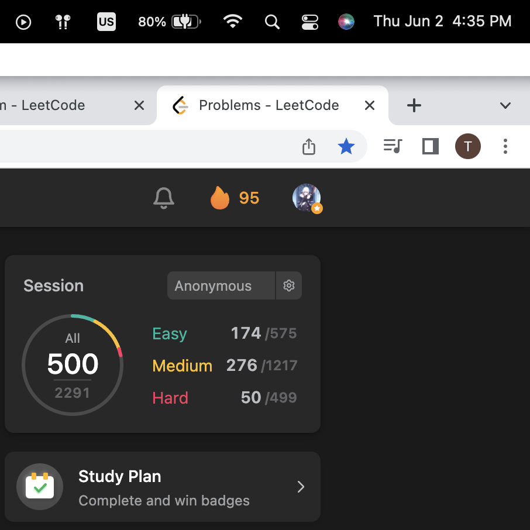

# 401-500

| Total | serial numbr             | Name                                                         | Catalog                            | Time |
| ----- | ------------------------ | ------------------------------------------------------------ | ---------------------------------- | ---- |
| 401   | Trie                     | [642. Design Search Autocomplete System](https://leetcode.com/problems/design-search-autocomplete-system) | Trie                               | 5.15 |
|       |                          |                                                              |                                    |      |
|       | Study Plan               | [1491. Average Salary Excluding the ](https://leetcode.com/problems/average-salary-excluding-the-minimum-and-maximum-salary/) | Array                              | 5.16 |
|       | Study Plan               | [191. Number of 1 Bits](https://leetcode.com/problems/number-of-1-bits/) | Bit manipulation                   | 5.16 |
|       | Study Plan               | [1281. Subtract the Product and Sum ](https://leetcode.com/problems/subtract-the-product-and-sum-of-digits-of-an-integer/) | Math                               | 5.16 |
|       | Explore                  | [421. Maximum XOR of Two Numbers in an Array](https://leetcode.com/problems/maximum-xor-of-two-numbers-in-an-array) | Trie                               | 5.16 |
|       | Explore                  | [79. Word Search](https://leetcode.com/problems/word-search) | Backtracking                       | 5.16 |
|       | Explore                  | [212. Word Search II](https://leetcode.com/problems/word-search-ii) | Trie + backtracking                | 5.16 |
|       | Study Plan               | [852. Peak Index in a Mountain Array](https://leetcode.com/problems/peak-index-in-a-mountain-array/) | Binary Search                      | 5.16 |
|       | Daily                    | [1379. Find a Corresponding Node of a Binary Tree in a Clone of That Tree](https://leetcode.com/problems/find-a-corresponding-node-of-a-binary-tree-in-a-clone-of-that-tree/) | Binary Tree                        | 5.16 |
| 410   | Study Plan               | [976. Largest Perimeter Triangle](https://leetcode.com/problems/largest-perimeter-triangle/) | Greedy                             | 5.16 |
|       | Study Plan               | [1779. Find Nearest Point That Has the Same X or Y Coordinate](https://leetcode.com/problems/find-nearest-point-that-has-the-same-x-or-y-coordinate) | Array                              | 5.16 |
|       |                          |                                                              |                                    |      |
|       | Study Plan               | [695. Max Area of Island](https://leetcode.com/problems/max-area-of-island/) | DFS                                | 5.17 |
|       | Study Plan               | [1254. Number of Closed Islands](https://leetcode.com/problems/number-of-closed-islands) | FLood fill                         | 5.17 |
|       | Explore                  | [422. Valid Word Square](https://leetcode.com/problems/valid-word-square) | Matrix                             | 5.17 |
|       | Explore                  | [425. Word Squares](https://leetcode.com/problems/word-squares) | **Trie + backtracking**            | 5.17 |
|       | Explore -- extremly hard | [336. Palindrome Pairs](https://leetcode.com/problems/palindrome-pairs) | **Trie**                           | 5.17 |
|       | Study Plan               | [1385. Find the Distance Value Between Two Arrays](https://leetcode.com/problems/find-the-distance-value-between-two-arrays) | Binary Search                      | 5.17 |
|       | Study Plan               | [1020. Number of Enclaves](https://leetcode.com/problems/number-of-enclaves/) | Flood fill                         | 5.17 |
|       | Study Plan               | [1905. Count Sub Islands](https://leetcode.com/problems/count-sub-islands) | DFS                                | 5.17 |
| 420   | Study Plan               | [1822. Sign of the Product of an Array](https://leetcode.com/problems/sign-of-the-product-of-an-array/) | Math                               | 5.17 |
|       | Study Plan               | [1502. Can Make Arithmetic Progression From Sequence](https://leetcode.com/problems/can-make-arithmetic-progression-from-sequence) | Sorting                            | 5.17 |
|       |                          |                                                              |                                    |      |
|       | Study Plan               | [1790. Check if One String Swap Can Make Strings Equal](https://leetcode.com/problems/check-if-one-string-swap-can-make-strings-equal) | Array                              | 5.18 |
|       | Study Plan               | [1162. As Far from Land as Possible](https://leetcode.com/problems/as-far-from-land-as-possible/) | BFS                                | 5.18 |
|       | Study Plan               | [417. Pacific Atlantic Water Flow](https://leetcode.com/problems/pacific-atlantic-water-flow/) | DFS                                | 5.18 |
|       | Study Plan               | [496. Next Greater Element I](https://leetcode.com/problems/next-greater-element-i/) | Monstack                           | 5.18 |
|       | Interesting              | [503. Next Greater Element II](https://leetcode.com/problems/next-greater-element-ii) | Monstack                           | 5.18 |
|       | Interesting              | [556. Next Greater Element III](https://leetcode.com/problems/next-greater-element-iii) | Greedy                             | 5.18 |
|       | Study Plan               | [1232. Check If It Is a Straight Line](https://leetcode.com/problems/check-if-it-is-a-straight-line) | Math                               | 5.18 |
|       | Daily                    | [1192. Critical Connections in a Network](https://leetcode.com/problems/critical-connections-in-a-network/) | **Circle detect**                  | 5.18 |
| 430   | Explore                  | [787. Cheapest Flights Within K Stops](https://leetcode.com/problems/cheapest-flights-within-k-stops) | Bellman ford                       | 5.18 |
|       | Daily                    | [329. Longest Increasing Path in a Matrix](https://leetcode.com/problems/longest-increasing-path-in-a-matrix/) | Topological sorting                | 5.18 |
|       |                          |                                                              |                                    |      |
|       | Study Plan               | [213. House Robber II](https://leetcode.com/problems/house-robber-ii/) | DP                                 | 5.19 |
|       | Study Plan               | [55. Jump Game](https://leetcode.com/problems/jump-game/)    | DP                                 | 5.19 |
|       | Study Plan               | [45. Jump Game II](https://leetcode.com/problems/jump-game-ii/) | DP                                 | 5.19 |
|       | Study Plan               | [1672. Richest Customer Wealth](https://leetcode.com/problems/richest-customer-wealth/) | Matrix                             | 5.19 |
|       | Study Plan               | [1588. Sum of All Odd Length Subarrays](https://leetcode.com/problems/sum-of-all-odd-length-subarrays/) | Math                               | 5.19 |
|       | Study Plan               | [876. Middle of the Linked List](https://leetcode.com/problems/middle-of-the-linked-list/) | Two Pointer                        | 5.19 |
|       | Interest                 | [1306. Jump Game III](https://leetcode.com/problems/jump-game-iii) | DFS                                | 5.19 |
|       | Interest                 | [1345. Jump Game IV](https://leetcode.com/problems/jump-game-iv) | BFS                                | 5.19 |
| 440   | Study Plan               | [1572. Matrix Diagonal Sum](https://leetcode.com/problems/matrix-diagonal-sum/) | Matrix                             | 5.19 |
|       | Study Plan               | [1768. Merge Strings Alternately](https://leetcode.com/problems/merge-strings-alternately/) | String                             | 5.19 |
|       |                          |                                                              |                                    |      |
|       | Interest                 | [1340. Jump Game V](https://leetcode.com/problems/jump-game-v) | DP: Iteration in Recursion         | 5.20 |
|       | Interest                 | [1696. Jump Game VI](https://leetcode.com/problems/jump-game-vi) | **DP + Mondeque**                  | 5.20 |
|       | Interest                 | [239. Sliding Window Maximum](https://leetcode.com/problems/sliding-window-maximum) | **Mondeque**                       | 5.20 |
|       | Interest                 | [1871. Jump Game VII](https://leetcode.com/problems/jump-game-vii) | DP + Slide window                  | 5.20 |
|       | Study Plan               | [441. Arranging Coins](https://leetcode.com/problems/arranging-coins/) | Binary Search                      | 5.20 |
|       | Study Plan               | [1539. Kth Missing Positive Number](https://leetcode.com/problems/kth-missing-positive-number/) | Binary Search                      | 5.20 |
|       | Study Plan               | [934. Shortest Bridge](https://leetcode.com/problems/shortest-bridge/) | Graph                              | 5.20 |
|       | Study Plan               | [1926. Nearest Exit from Entrance in Maze](https://leetcode.com/problems/nearest-exit-from-entrance-in-maze/) | BFS                                | 5.20 |
| 450   | Study Plan               | [152. Maximum Product Subarray](https://leetcode.com/problems/maximum-product-subarray) | DP                                 | 5.20 |
|       | Study Plan               | [1567. Maximum Length of Subarray Wit](https://leetcode.com/problems/maximum-length-of-subarray-with-positive-product/) | DP                                 | 5.20 |
|       |                          |                                                              |                                    |      |
|       | Study Plan               | [1608. Special Array With X Elements G](https://leetcode.com/problems/special-array-with-x-elements-greater-than-or-equal-x/) | Binary Search                      | 5.21 |
|       | Study Plan               | [1678. Goal Parser Interpretation](https://leetcode.com/problems/goal-parser-interpretation) | String                             | 5.21 |
|       | Explore                  | [210. Course Schedule II](https://leetcode.com/problems/course-schedule-ii) | **Topological sort**               | 5.21 |
|       | Explore                  | [269. Alien Dictionary](https://leetcode.com/problems/alien-dictionary) | **Topological sort**               | 5.21 |
|       | Explore                  | [207. Course Schedule](https://leetcode.com/problems/course-schedule) | **Cycle Detection**                | 5.21 |
|       | Explore                  | [310. Minimum Height Trees](https://leetcode.com/problems/minimum-height-trees) | **Topological sort**               | 5.21 |
|       | Contest                  | [2278. Percentage of Letter in String](https://leetcode.com/problems/percentage-of-letter-in-string) | Iteration                          | 5.21 |
|       | Contest                  | [2279. Maximum Bags With Full Capacity of Rocks](https://leetcode.com/problems/maximum-bags-with-full-capacity-of-rocks) | Greedy                             | 5.21 |
| 460   | Contest                  | [2280. Minimum Lines to Represent a Line Chart](https://leetcode.com/problems/minimum-lines-to-represent-a-line-chart) | Math                               | 5.21 |
|       | Contest                  | [2281. Sum of Total Strength of Wizards](https://leetcode.com/problems/sum-of-total-strength-of-wizards) | **Monstack + Prefix**              | 5.21 |
|       |                          |                                                              |                                    |      |
|       | Daily                    | [647. Palindromic Substrings](https://leetcode.com/problems/palindromic-substrings/) | DP                                 | 5.22 |
|       | Explore                  | [1136. Parallel Courses](https://leetcode.com/problems/parallel-courses) | Topological sort                   | 5.22 |
|       | Study Plan               | [1351. Count Negative Numbers in a Sorted Matrix](https://leetcode.com/problems/count-negative-numbers-in-a-sorted-matrix/) | Binary Search                      | 5.22 |
|       | Study Plan               | [1014. Best Sightseeing Pair](https://leetcode.com/problems/best-sightseeing-pair) | DP                                 | 5.22 |
|       | Study Plan               | [1319. Number of Operations to Make Network Connected](https://leetcode.com/problems/number-of-operations-to-make-network-connected) | UF or DFS                          | 5.22 |
|       | Study Plan               | [617. Merge Two Binary Trees](https://leetcode.com/problems/merge-two-binary-trees) | DFS                                | 5.22 |
|       | Study Plan               | [709. To Lower Case](https://leetcode.com/problems/to-lower-case) | String                             | 5.22 |
|       | Daily                    | [474. Ones and Zeroes](https://leetcode.com/problems/ones-and-zeroes/) | **DP**                             | 5.22 |
| 470   | Study Plan               | [953. Verifying an Alien Dictionary](https://leetcode.com/problems/verifying-an-alien-dictionary/) | String                             | 5.22 |
|       | Study Plan               | [1309. Decrypt String from Alphabet to Integer Mappping](https://leetcode.com/problems/decrypt-string-from-alphabet-to-integer-mapping/) | String                             | 5.22 |
|       |                          |                                                              |                                    |      |
|       | Study Plan               | [1290. Convert Binary Number in a Linked List to Integer](https://leetcode.com/problems/convert-binary-number-in-a-linked-list-to-integer) | Bit manipulation                   | 5.23 |
|       | Study Plan               | [404. Sum of Left Leaves](https://leetcode.com/problems/sum-of-left-leaves) | DFS                                | 5.23 |
|       | Study Plan               | [1356. Sort Integers by The Number of 1 Bits](https://leetcode.com/problems/sort-integers-by-the-number-of-1-bits) | Bit manipulation                   | 5.23 |
|       | Study Plan               | [1603. Design Parking System](https://leetcode.com/problems/design-parking-system/) | System design                      | 5.23 |
|       | Study Plan               | [303. Range Sum Query - Immutable](https://leetcode.com/problems/range-sum-query-immutable) | Prefix Sum                         | 5.23 |
|       | Study Plan               | [40. Combination Sum II](https://leetcode.com/problems/combination-sum-ii) | Backtracking                       | 5.23 |
|       | Study Plan               | [377. Combination Sum IV](https://leetcode.com/problems/combination-sum-iv) | **DP**                             | 5.23 |
|       | Weekly                   | [277. Find the Celebrity](https://leetcode.com/problems/find-the-celebrity) | Greedy                             | 5.23 |
| 480   | Daily                    | [32. Longest Valid Parentheses](https://leetcode.com/problems/longest-valid-parentheses) | **DP or Stack**                    | 5.23 |
|       | Study Plan               | [784. Letter Case Permutation](https://leetcode.com/problems/letter-case-permutation) | Backtracking                       | 5.23 |
|       |                          |                                                              |                                    |      |
|       | Study Plan               | [633. Sum of Square Numbers](https://leetcode.com/problems/sum-of-square-numbers) | Two pointer                        | 5.24 |
|       | Study Plan               | [1855. Maximum Distance Between a Pair of Values](https://leetcode.com/problems/maximum-distance-between-a-pair-of-values) | Two Pointer                        | 5.24 |
|       | Study Plan               | [120. Triangle](https://leetcode.com/problems/triangle)      | DP                                 | 5.24 |
|       |                          |                                                              |                                    |      |
|       | Daily                    | [354. Russian Doll Envelopes](https://leetcode.com/problems/russian-doll-envelopes) | **Longest Increasing Subsequence** | 5.25 |
|       | Study Plan               | [231. Power of Two](https://leetcode.com/problems/power-of-two/) | **Bit manipulation**               | 5.25 |
|       | Study Plan               | [190. Reverse Bits](https://leetcode.com/problems/reverse-bits) | **Bit manipulation**               | 5.25 |
|       | Study Plan               | [1376. Time Needed to Inform All Employees](https://leetcode.com/problems/time-needed-to-inform-all-employees) | DFS                                | 5.25 |
|       | Study Plan               | [802. Find Eventual Safe States](https://leetcode.com/problems/find-eventual-safe-states/) | Topological sort                   | 5.25 |
| 490   | Study Plan               | [1129. Shortest Path with Alternating Colors](https://leetcode.com/problems/shortest-path-with-alternating-colors) | BFS                                | 5.25 |
|       |                          |                                                              |                                    |      |
|       | Daily                    | [1342. Number of Steps to Reduce a Number to](https://leetcode.com/problems/number-of-steps-to-reduce-a-number-to-zero/) | Bit manipulation                   | 5.26 |
|       |                          |                                                              |                                    |      |
|       | Daily                    | [318. Maximum Product of Word Lengths](https://leetcode.com/problems/maximum-product-of-word-lengths/) | Bit manipulation                   | 5.27 |
|       |                          |                                                              |                                    |      |
|       | Contest                  | [2287. Rearrange Characters to Make Target St](https://leetcode.com/problems/rearrange-characters-to-make-target-string) | String                             | 5.28 |
|       | Contest                  | [2288. Apply Discount to Prices](https://leetcode.com/problems/apply-discount-to-prices) | String                             | 5.28 |
|       |                          |                                                              |                                    |      |
|       | Daily                    | [1461. Check If a String Contains All Binary Codes of Size K](https://leetcode.com/problems/check-if-a-string-contains-all-binary-codes-of-size-k/) | Bit                                | 5.29 |
|       |                          |                                                              |                                    |      |
|       | Daily                    | [29. Divide Two Integers](https://leetcode.com/problems/divide-two-integers/) | Bit                                | 5.30 |
|       |                          |                                                              |                                    |      |
|       | Daily                    | [1480. Running Sum of 1d Array](https://leetcode.com/problems/running-sum-of-1d-array/) | Prefix sum                         | 5.31 |
|       |                          |                                                              |                                    |      |
|       | Daily                    | [867. Transpose Matrix](https://leetcode.com/problems/transpose-matrix/) | Matrix                             | 6.1  |
|       |                          |                                                              |                                    |      |
|       | Weekly                   | [1197. Minimum Knight Moves](https://leetcode.com/problems/minimum-knight-moves) | BFS                                | 6.2  |
| 500   | Interesting              | [18. 4Sum](https://leetcode.com/problems/4sum)               | TwoSum                             | 6.2  |

