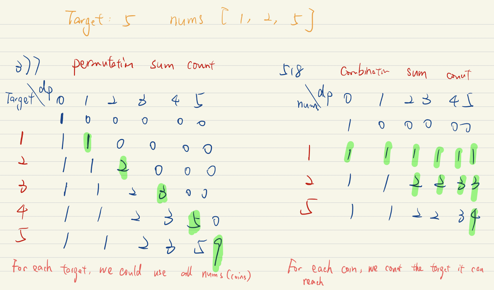

#### Difference between [377. Combination Sum IV](https://leetcode.com/problems/combination-sum-iv) with [518. Coin Change 2](https://leetcode.com/problems/coin-change-2)

==The order of the loop==



#### Bottom up

```java
class Solution {
    public int combinationSum4(int[] nums, int target) {
        int[] dp = new int[target + 1];
        dp[0] = 1;
        
        for (int i = 1; i <= target; i += 1) {
            for (int num: nums) {
                if (i - num >= 0) {
                    dp[i] += dp[i - num];
                }
            }
        }
        
        return dp[target];
    }
}
```


#### Top down

```java
class Solution {
    private HashMap<Integer, Integer> memo;

    public int combinationSum4(int[] nums, int target) {
        // minor optimization
        // Arrays.sort(nums);
        memo = new HashMap<>();
        return combs(nums, target);
    }

    private int combs(int[] nums, int remain) {
        if (remain == 0)
            return 1;
        if (memo.containsKey(remain))
            return memo.get(remain);

        int result = 0;
        for (int num : nums) {
            if (remain - num >= 0)
                result += combs(nums, remain - num);
            // minor optimizaton, early stopping
            // else
            //     break;
        }
        memo.put(remain, result);
        return result;
    }
}
```

